author: Josué Cortez
summary: Introducción a Oracle
id: laboratorio-01
tags: guide
categories: Introducción a Oracle
environments: Web
status: Published
feedback link: https://github.com/vareladev/vareladev.github.io/issues

<link rel="stylesheet" href="style.css">

# Introducción a Oracle

## Objetivos
* Conocer las herramientas para la administración de base de datos (Oracle SQL Developer y SQL Plus).
* Crear de manera correcta una base de datos en ambos clientes SQL Developer y SQL Plus.
* Verificar y gestionar los servicios de Oracle.

## Herramientas
Para esta práctica se utilizarán las siguientes herramientas:

### Oracle DB 19C

Oracle Database es un sistema de gestión de base de datos de tipo objeto-relacional (ORDBMS, por el acrónimo en inglés de Object-Relational Data Base Management System), desarrollado por Oracle Corporation. <strong>Oracle Database 19c</strong> es la versión actual a largo plazo, que además proporciona el nivel más alto de estabilidad de la versión y el plazo más largo para asistencia y corrección de errores.

### SQL Developer

Es una interfaz gráfica de usuario gratuita que permite a los usuarios y administradores de bases de datos realizar sus tareas con menos clicks y pulsaciones de teclas. SQL Developer es una herramienta de productividad cuyo objetivo principal es ayudar al usuario final a   ahorrar tiempo y maximizar el retorno de la inversión en el paquete de tecnología de Oracle Database.

### SQL Plus
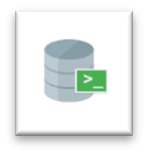
Es un programa de línea de comandos de Oracle que puede ejecutar comandos SQL y PL/SQL de forma interactiva o mediante un script. SQL*Plus opera como una herramienta relativamente simple con una interfaz de líneas de comando básica. Los programadores y los administradores de bases de datos (DBA's) lo usan de forma muy común como interfaz fundamental en la mayoría de las instalaciones de software de Oracle.

## Introducción
En esta guía se pretende dar una introducción a lo que es el mundo de Oracle y más específicamente lo que se refiere a sus clientes para la administración de la base de datos (SQL Developer y Plus). Dando un repaso sobre las características y ventajas que estos clientes poseen y además explicando paso a paso la gestión de los servicios de Oracle, así como también la creación de nuevas conexiones (bases de datos).

## Servicios
Un servicio es un pequeño programa que normalmente se inicia cuando se carga el sistema operativo Windows. Los usuarios no interactúan directamente con los servicios como lo hacen con los programas regulares porque se ejecutan en segundo plano (no se ven) y no proporcionan una interfaz de usuario normal.

Windows puede usar los servicios para controlar muchas cosas, como imprimir, compartir archivos, comunicarse con dispositivos Bluetooth, buscar actualizaciones de software, alojar un sitio web; en este caso se encargan de gestionar ciertos parámetros de Oracle DB.

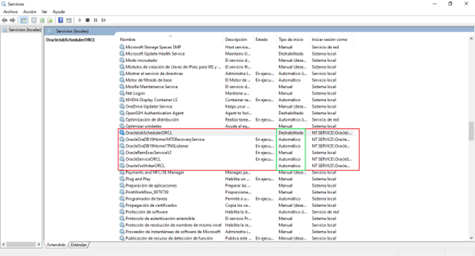

En la ventana verás el nombre de cada uno, una breve descripción de las funciones que realiza, su estado y el tipo de inicio. El tipo de inicio indica el comportamiento del servicio cuando arranca el sistema operativo. Existen cinco tipos:

* Automático, que se inicia con cada arranque del sistema.
* Automático (inicio retrasado), espera a que el sistema operativo se haya cargado y se inicia automáticamente.
* Manual, se inicia cuando una aplicación lo necesita.
* Manual (desencadenar inicio). El servicio sólo se iniciará si no hay demasiados servicios en ejecución.
* Deshabilitado, el servicio no se puede iniciar.

## Características y Ventajas de los Clientes
Ambos clientes nos brindan características propias interesantes y además ventajas entre los mencionados anteriormente en los cuales cabe destacar los puntos que se muestran continuación:

### SQL Developer
* Crear conexiones.
* Creación y mantenimiento de objetos.
* Ejecutar, editar y depurar PL/SQL.
* Ejecutar y crear informes.
* Visor de Data Modeler.

### SQL Plus
* Escribir, editar y ejecutar comandos SQL y bloques PL/SQL.
* Dar formato a los resultados de las consultas.
* Visualizar las estructuras de las tablas y copiar datos entre bases de datos.
* Ejecutar comandos y operaciones de entrada/salida (introducción, presentación y manipulación de variables).

### Ventajas
<table>
    <thead>
        <tr>
            <td><strong>SQL Developer</strong></td>
            <td><strong>SQL Plus</strong></td>
        </tr>
    </thead>
    <tbody>
        <tr>
            <td>Cuenta con interfaz gráfica (GUI)</td>
            <td>Cuando queremos usar SHELL para acceder a la base de datos en la plataforma UNIX (como hacer algunas operaciones en segundo plano, tareas de tiempo, etc.), SQLPLUS es la única opción en este momento.</td>
        </tr>
        <tr>
            <td>Brinda diversas herramientas para la creación de diagramas</td>
            <td>SQL Plus es una herramienta que viene con Oracle, siempre que la base de datos esté instalada. Por lo tanto, si se llegara a presentar inconvenientes al momento de iniciar sesión con el SQL Developer, al ser independientes entre sí, se podría ingresar del SQL Plus sin ningún problema</td>
        </tr>
        <tr>
            <td>Permite trabajar con múltiples conexiones simultáneamente</td>
            <td>---------</td>
        </tr>
    </tbody>
</table>

## Conexión a SQL Developer
En Oracle una <strong>nueva conexión</strong> es equivalente a una base de datos para otros gestores ya conocidos, en este caso para crear una nueva conexión basta con darle click en el botón como la figura 1 lo indica. Otra forma es dar click derecho donde dice “Oracle Conexiones” y luego a “Nueva Conexión a bases de datos”

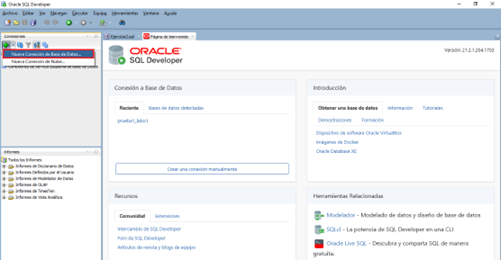

Al crear la conexión se nos desplegara una ventana en el cual se nos muestra unos campos vacíos los cuales serán configurados de la siguiente manera:

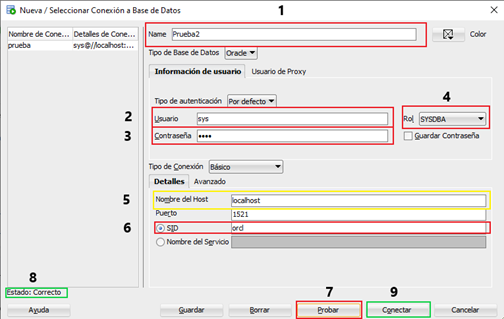

1. Asignación del nombre de la nueva base de datos.
2. Usuario de administración de la nueva base de datos.
3. Contraseña del usuario.
4. Rol asignado al usuario de la base de datos.
5. Nombre del host, al ser una conexión local se coloca “localhost”.
6. Nombre de la instancia donde se ejecutará la nueva base de datos.
7. Prueba la conexión a la nueva base de datos.
8. Muestra el estado de conexión.
9. Valida y crea la conexión previamente configurada.

## Ejercicio
Crear una base de datos a partir del banco de datos proporcionado
[Script del banco de datos](../files/laboratorio01/banco_datos.sql)

1. Asignarle una conexión al archivo .sql.

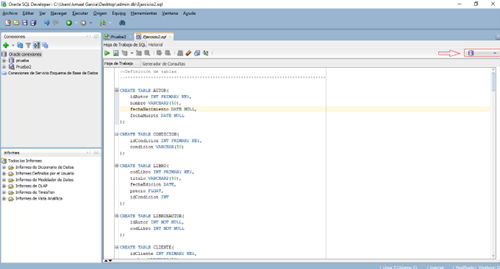

2. Seleccionar la base de datos.

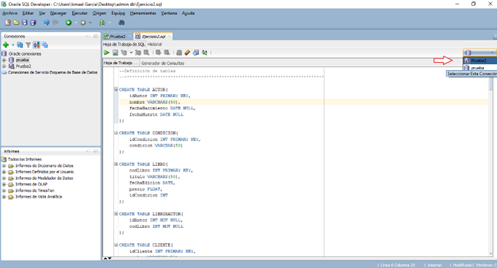

3. Se seleccionan las sentencias sql a ejecutar para crear la base de datos.

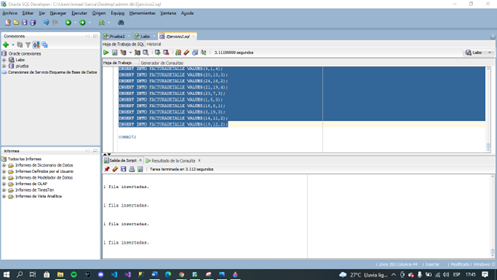

## Conexión a SQL Plus
Al abrir la consola de SQL Plus o cualquier otro tipo de consola de nuestro sistema operativo Windows, basta con ingresar el nombre del usuario con acceso a la base de datos y el rol al mismo tiempo. Como, por ejemplo: “sys as sysdba” (Ver imagen).

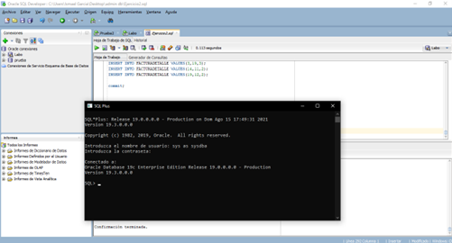

Luego de haber ingresado con el usuario respectivo de manera correcta, se puede ejecutar cualquier sentencia sql, en este caso para el ejemplo: “SELECT * FROM FACTURADETALLE”.

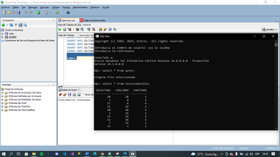

<aside class="positive block-text">
<strong>Nota:</strong> Siempre que se modifique la base de datos y estamos seguros de los cambios que se han realizado, es recomendable confirmar la transacción a través de un <strong>commit</strong>, Oracle gestiona muchas actividades en memoria, confirmar la transacción permite guardar los cambios en disco.
</aside>

## Creación de diagrama de una base de datos
Para generar un diagrama en SQL Developer hay que seguir la siguiente ruta de acceso Archivo > Data Modeler > Importar > Diccionario de Datos, el cual se verá reflejado de la siguiente manera:

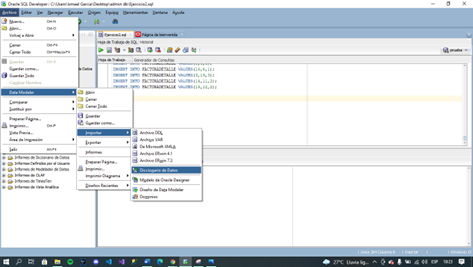

Se selecciona la base de datos con la cual se está trabajando y se da click en siguiente

En este paso se utiliza el filtro y se coloca “sys”, luego realizamos la búsqueda y marcamos la casilla con la opción “SYS” y se da click en siguiente.

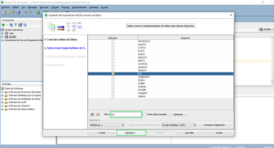

En esta ventana se seleccionan todas las tablas que se desean incluir en el diagrama y luego se da en la opción de siguiente.

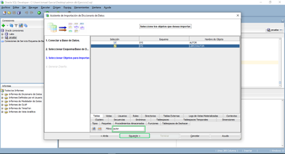

Aquí se muestra la cantidad de tablas seleccionadas previamente, solo se da click en siguiente para que ver el diagrama generado.

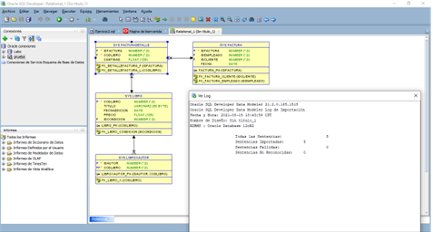

Ya teniendo el diagrama creado, procedemos a dar click derecho en el espacio en blanco y seleccionamos la opción de “Imprimir Diagrama” y luego escoges el tipo de archivo que queremos, en nuestro caso será tipo imagen.

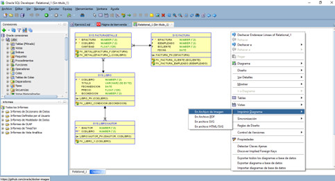

Y por último proceden agregan un nombre y lo guardan en su lugar de preferencia.

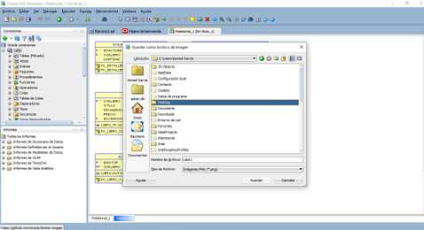

## Ejemplos

### Ejercicio 1
Mostrar la lista de libros disponibles y ordenados de manera alfabética

### Ejercicio 2
Mostrar la lista de libros que no tengan asignado ningún autor.

### Diagrama relacional para los ejemplos
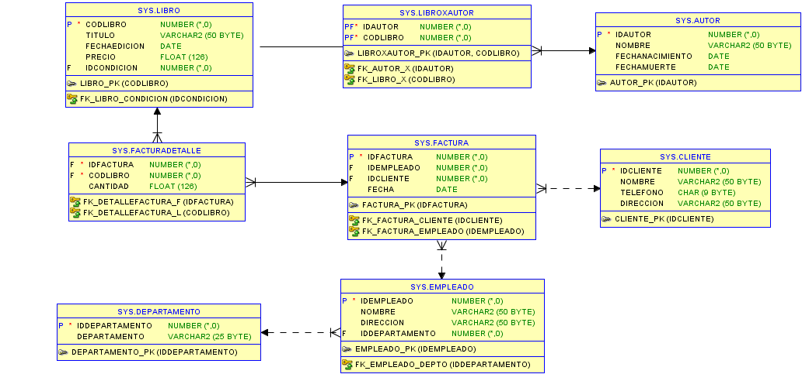

## Actividad evaluada
Realizar los ejercicios que sean asignados por su instructor, las indicaciones sobre esta actividad se van a definir en las sesiones de laboratorio.

### Ejercicio 1
Mostrar el top 5 de los autores más populares en la primera quincena de enero de 2018. (NOTA: la popularidad de un libro se define en cuantas veces se ha vendido). Vista esperada (vista completa):

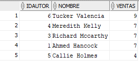

### Ejercicio 2
Mostrar el detalle de cada factura, incluir el nombre del cliente, el título de libro, el precio y la cantidad comprada. Vista esperada (vista parcial).

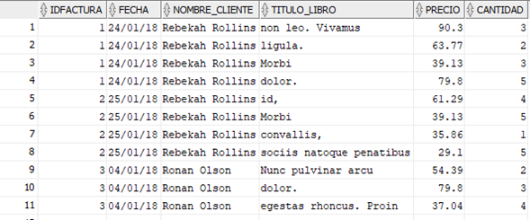

### Ejercicio 3
Mostrar la lista de facturas con el precio total resultante de realizar el siguiente cálculo. Vista esperada (vista parcial).

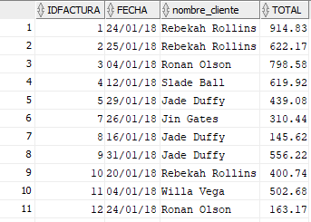

### Ejercicio 4
Definir la lista de clientes frecuentes del mes. Para ello, es necesario definir la cantidad de libros que cada cliente ha comprado, un cliente se considera frecuente si ha comprado 10 o más libros. Vista esperada (vista completa):

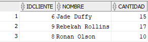

## Sobre los autores de esta guía de laboratorio.

**Autores**

  **Versión 1:**
Ismael Chicas Garcia (00036818@uca.edu.sv), Oscar Rivas Borjas (00005218@uca.edu.sv), Erick Varela Guzmán (evarela@uca.edu.sv).

  **Versión 2:**
Josué Cortez (00402918@uca.edu.sv)

  **Correspondencia:**
Erick Varela Guzmán (evarela@uca.edu.sv)

Departamento de Electrónica e Informática, Universidad Centroamericana José Simeón Cañas, La Libertad, El Salvador.

Versión de este documento: Versión 2, Agosto 2022.

 This work is licensed under a [Creative Commons Attribution-NonCommercial-ShareAlike 4.0 International License](http://creativecommons.org/licenses/by-nc-sa/4.0/).