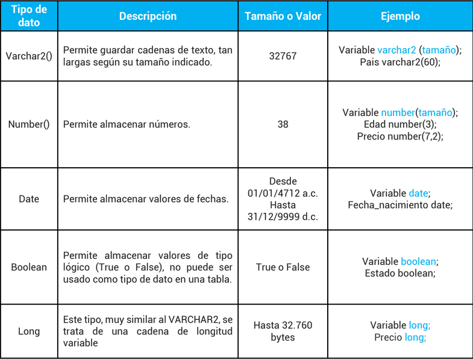

author: Brian Carranza, Alejandro Cerón
summary: PL/SQL
id: laboratorio-02
tags: guide
categories: PL/SQL
environments: Web
status: Published
feedback link: https://github.com/vareladev/vareladev.github.io/issues

<link rel="stylesheet" href="style.css">


# PL/SQL

## Objetivos
Duration: 0:3:00

* Conocer la sintaxis de las funciones, procedimientos y triggers en Oracle.
* Utilizar la salida de pantalla con ayuda de DBMS output.
* Crear distintos tipos de sentencias como Estructuras de control básicas,
funciones, procedimientos almacenados, triggers y bloques anónimos.

## Herramientas
Duration: 0:6:00

Para esta práctica se utilizarán las siguientes herramientas:

### Oracle DB 19C

Oracle Database es un sistema de gestión de base de datos
de tipo objeto-relacional (ORDBMS, por el acrónimo en inglés
de Object-Relational Data Base Management System),
desarrollado por Oracle Corporation. Oracle Database 19c es la versión actual a largo plazo, que además proporciona el nivel más alto de estabilidad de la versión y el plazo más largo para asistencia y corrección de errores.


### SQL Developer

Es una interfaz gráfica de usuario gratuita que permite a los usuarios y administradores de bases de datos realizar sus tareas con menos clicks y pulsaciones de teclas. SQL Developer es una herramienta de productividad cuyo objetivo principal es ayudar al usuario final a ahorrar tiempo y maximizar el retorno de la inversión en el paquete de tecnología de Oracle Database.


## Introducción
Duration 0:2:00

En esta guía se dará a conocer que es el PL/SQL a profundidad, los diversos tipos de datos que existen en el gestor, cómo podremos ser capaces de mostrar salida de pantalla, a su vez conoceremos la sintaxis básica de las distintas sentencias que se pueden utilizar en Oracle.


## ¿Qué es PL/SQL?
Duration 0:20:00

### Definición 
PL/SQL es un lenguaje de procedimiento diseñado específicamente para abarcar sentencias SQL dentro de su sintaxis. El servidor de Oracle Database compila las
unidades de programa PL/SQL y se almacenan dentro de la base de datos. Y en tiempo de ejecución, tanto PL/SQL como SQL se ejecutan dentro del mismo proceso de servidor, brindando una eficiencia óptima. PL/SQL hereda automáticamente la robustez, la seguridad y la portabilidad de Oracle Database.

### Tipos de datos
En Oracle existen varios tipos de datos, los tipos más comunes en un programa son: number, varchar2, date, Boolean.


### Bloques anónimos
Los bloques anónimos no tienen ningún nombre concreto, por eso de anónimos. Un bloque PL/SQL es definido por las palabras clave DECLARE, BEGIN, EXCEPTION, y END, que dividen el bloque en tres secciones
* Declare: Se definen los distintos objetos que se van a utilizar en el bloque (variables, constantes, cursores, etcétera). Esta sección es opcional.
* Begin: En esta zona estará el código PL/SQL que ejecutaremos.
* Exception: Es una sección opcional donde se tratan todos los errores que puedan surgir a la hora de ejecutar las sentencias SQL y PL/SQL de la sección de instrucciones.
* End: Indica el cierre del bloque anónimo.

Un bloque es en sí mismo una sentencia ejecutable, por lo que se pueden anidar los bloques unos dentro de otros.

Sintaxis:

```
DECLARE
    --Declaración de variable
BEGIN
    --Instrucciones PL/SQL
EXCEPTION
    --Tratamiento de excepciones
END;
```

### Declaración de variables y constantes
* Variables: Las variables son nombres para procesar los elementos de los datos.

Sintaxis:

```
Nombre_variable tipo [NOT NULL] [:= valor | DEFAULT valor]
```

* Constantes: Las constantes son como las variables, pero no puede modificarse su valor. 

Sintaxis:

```
Nombre_constante CONSTANT tipo_de_dato := valor
```

<aside class="positive">
El signo de “:=” y “DEFAULT” tienen la misma función. Si ponemos NOT NULL es obligatorio inicializar la variable. 
</aside>

### Guardar valores a partir de una consulta SELECT
Al tener una tabla origen, podemos insertar los datos de dicha tabla a una nueva tabla destino. Se puede elegir ciertos campos de la tabla o bien se pueden insertar todos, teniendo en cuenta que ambas tienen que tener los mismos capos con su mismo tipo de dato. 

Sintaxis:

```
INSERT INTO nombre_tabla SELECT * FROM nombre_tabla_fuente
```

## Salida de pantalla DBMS Output
Duration: 0:02:00

Al haber iniciado SQL Developer daremos en la opción “Ver”.


Posteriormente se seleccionará la opción de “salida DBMS”.


Luego podremos imprimir valores en consola dándole en ejecutar.


