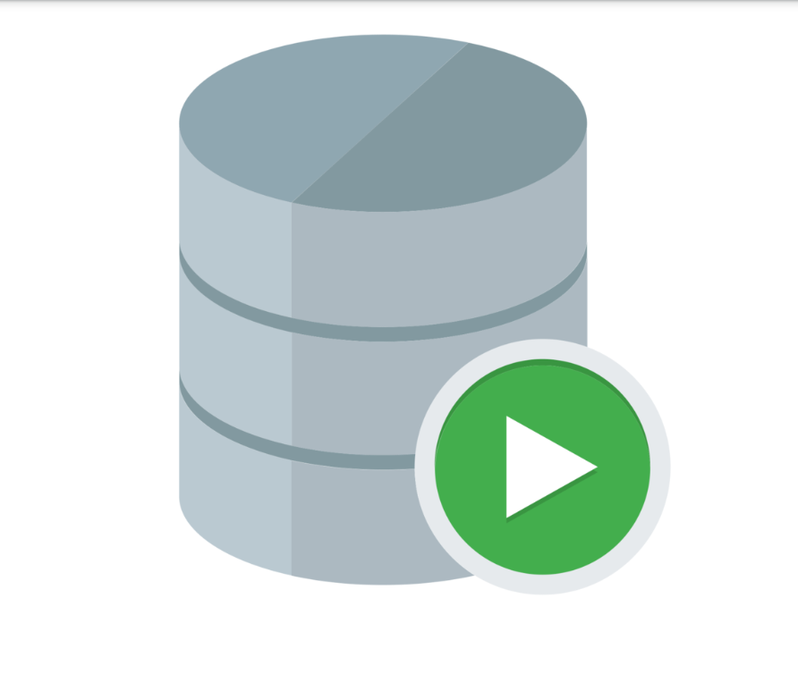
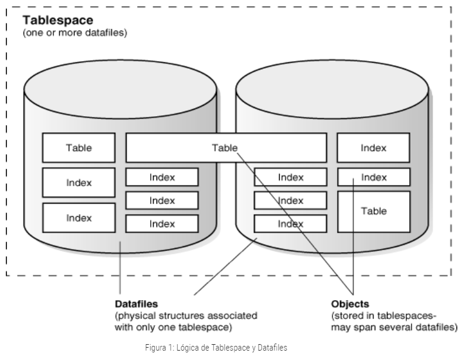
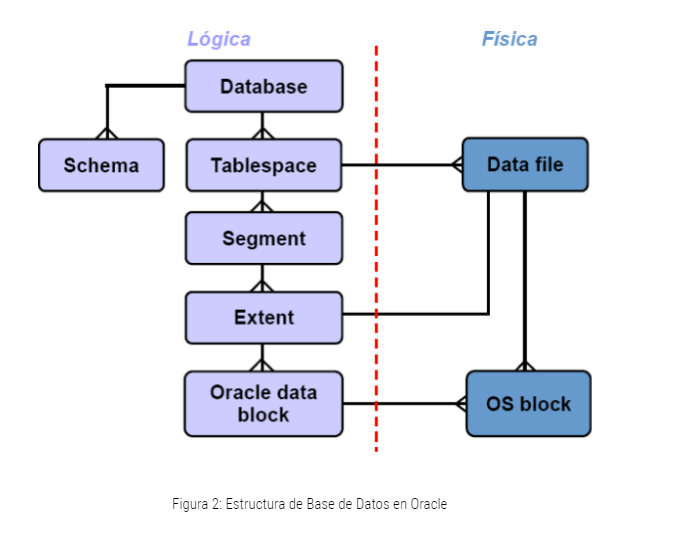
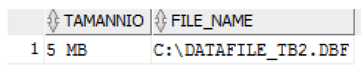
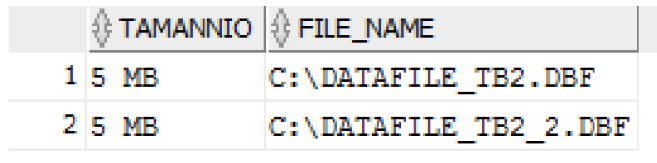
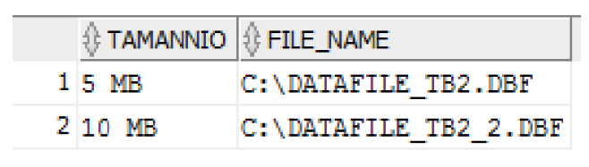
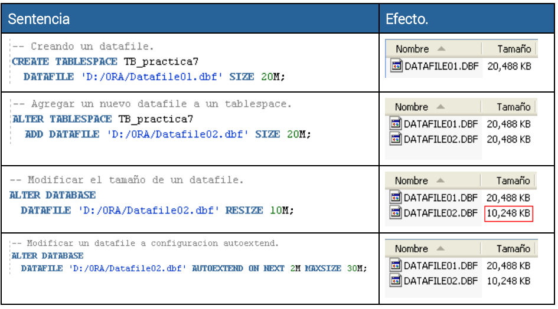
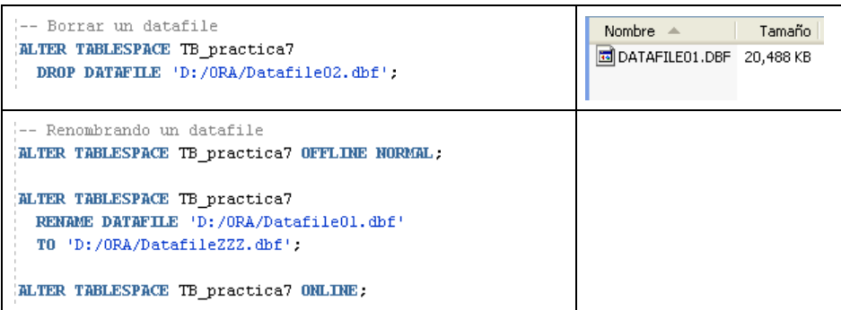

author: Fernando Melendez, Marcos Granillo
summary: Laboratorio sobre Administración de alamacenamiento y usuarios 
id: laboratorio-03
tags: guide. 
categories: Roles, Usuarios.
environments: Web
status: Published
feedback link: https://github.com/vareladev/vareladev.github.io/issues

<link rel="stylesheet" href="style.css">

# Administaricón de Almacenamiento y usuarios 

## Objetivos 
Duration: 0:01:00

  * Administrar el almacenamiento de Oracle a través Tablespace y Datafiles.
* Conocer como es la sintaxis de la creación de un usuario y perfiles.
* Aprender los diferentes tipos de roles para los usuarios.

## Herramientas 
Duration: 0:01:00

Para esta práctica se hará uso de estas herramientas: 

### Oracle DB 19c 


Oracle Database es un sistema de gestión de base de datos de tipo objeto-relacional (ORDBMS, por el acrónimo en inglés de Object-Relational Data Base Management System), desarrollado por Oracle Corporation. Oracle Database 19c es la versión actual a largo plazo, que además proporciona el nivel más alto de estabilidad de la versión y el plazo más largo para asistencia y corrección de errores.

### SQL Developer 


Es una interfaz gráfica de usuario gratuita que permite a los usuarios y administradores de bases de datos realizar sus tareas con menos clicks y pulsaciones de teclas. SQL Developer es una herramienta de productividad cuyo objetivo principal es ayudar al usuario final a ahorrar tiempo y maximizar el retorno de la inversión en el paquete de tecnología de Oracle Database.

## Introducción
Duration: 0:01:00

En esta guía se dará a conocer las diferencias entre un tablespaces y datafiles, al igual que como se administran cada uno de ellos, como puede ser crearlos, cambiar sus parámetros y eliminarlos. Al igual aprenderemos como crear usuarios, a crear roles que estos mismos usuarios pueden tener y crear perfiles, y como podemos dejarles ciertos permisos dependiendo de las tareas que deben realizar.

## Administración de almacenamiento
Duration: 0:05:00
Como sabemos, Oracle guarda los datos de manera lógica en un tablespace y  físicamente en datafiles, que corresponden o están asociados a los tablespaces. Las bases de datos, tablespaces y datafiles están estrechamente relacionadas, pero es  de importancia saber que existen diferencias muy grandes:

* Una base de datos Oracle consiste en uno o más unidades de almacenamiento lógico llamados tablespaces, estos tablespaces son los que guardan todos los datos de la base de datos.
* Cada tablespaces en una base de datos Oracle consiste en uno o más archivos llamados datafiles, los cuales son la estructura física de los tablespaces.
* Los datos son guardados en datafiles que constituyen cada tablespace de la base   de datos, por ejemplo, la base de datos más simple podría tener como mínimo un tablespace y un datafiles.



## Tablespace
Duration: 0:30:00

La estructura lógica está formada por los tablespace y los objetos de un esquema de la base de  datos (tablas, vistas, índices…) 



Una base de datos está formada por una o varias unidades lógicas llamadas Tablespaces. Un tablespace es la unidad de almacenamiento lógico. Además, cada una de estos Tablespaces está formada por uno o varios ficheros físicos que son los datafiles. Un datafile solamente puede pertenecer a un tablespace. Por lo tanto, los datafiles de una base de datos son todos los datafiles que forman parte de todos los tablespaces de la base.
Cuando se crea una base de datos, hay que crear al menos un tablespace, por lo que durante el proceso de creación de la base de datos siempre se indica el tablespace principal de ésta, que se llama SYSTEM.

*Propiedades:* 
* Localización de los ficheros de datos.
* Especificación de máximas cuotas de consumo de disco.
* Backup de datos.

Cuando un objeto se crea dentro de un cierto Tablespace, este objeto adquiere todas las
propiedades antes descritas del Tablespace utilizado.

*Características:*
*  Debe estar asociado a un Datafiles.
*  Un Tablespace está asociado a uno o varios Datafiles y puede tener uno o ovarios usuarios.

### 5.1 Creación de Tablespace
Una de las tareas habituales en la administración de una base de datos Oracle es la de crear
un nuevo Tablespace para contener nuevos objetos, La sentencia CREATE TABLESPACE sirve
para crear un tablespace en una base de datos Oracle. Recordemos que los Tablespaces
permanentes contienen objetos, tablas, índices, etc. de uno o más esquemas. Los objetos en
los tablespaces permanentes se almacenan en archivos de datos, datafiles.

**Ejemplo 1.1** 
```
    CREATE TABLESPACE tablespace1
    DATAFILE 'C:/datafile_tb1.dbf' SIZE 10M;
```

### 5.2 SQL Developer 
Podemos crear tablespaces donde el/los datafiles se vayan extendiendo de forma automática,
si lo creamos de esta manera debemos tener cuidado en no olvidar la cláusula MAXSIZE, ya
que si la omitimos el datafile se extenderá hasta llenar el filesystem donde esté creado. 

**Ejemplo 1.2** 
```
  CREATE TABLESPACE tablespace2
    DATAFILE 'C:/datafile_tb2.dbf' SIZE 5M
    AUTOEXTEND ON NEXT 1M MAXSIZE 20M;
```
#### Ejercicio 1
Crear un tablespace auto expandible llamado TB_&lt;Carnet&gt;	 (sustituir “&lt;Carnet&gt;” por su número de carnet), asignar un datafile de 8 megabytes y que será guardado en el disco C. El tamaño máximo será de 36 Megabytes con extensiones de 4 Megabytes.

### 5.3 SQL Developer
Para cambiar el tamaño de un tablespace tenemos dos posibles opciones:
*  Modificar el tamaño de un datafile.
*  Agregar un nuevo datafile.
* 
**Ejemplo 1.3. agregando nuevos datafiles.**

Ahora modificaremos el tablespace creado en el Ejercicio 1. Antes de modificarlo es
recomendable ver cuántos datafiles conforman el tablespace, y que tamaño tienen, para en base
a esta información, añadir uno nuevo, siguiendo el estándar de nombres, y el tamaño apropiado.

A continuación, se presenta la forma de ver la información de los datafiles del tablespace.

```
  SELECT * FROM DBA_TABLESPACES;
  SELECT * FROM DBA_DATA_FILES;
```

Si ejecutamos este SELECT con el tablespace llamado “tablespace2” veremos la siguiente información:



Lo que nos indica que este tablespace posee un solo datafile de 5 MB de tamaño. A continuación, agregamos un nuevo datafile.

```
  ALTER TABLESPACE tablespace2
   ADD DATAFILE 'C:/datafile_tb2_2.dbf' SIZE 5M AUTOEXTEND OFF;
```

#### Ejercicio 2
Añadir un nuevo datafile al tablespace creado en el ejercicio 1. El tamaño será 10 Megabytes y será almacenado en el disco C:.


Mostrando la información de tablespace2 nuevamente:




**Ejemplo 1.4 modificando un datafile.**

También podemos modificar un datafile existente.

```
  ALTER DATABASE DATAFILE 'C:/datafile_tb2_2.dbf' RESIZE 10M;
```

Mostrando la información de tablespace2 nuevamente:



#### Ejercicio 3
Redimensionar el segundo datafile creado a 16 Megabytes.

### 5.4. SQL Developer
Primero debemos asegurarnos de que el contenido de los archivos de datos no es necesario, o se ha movido a otro tablespace.

**Ejemplo 1.5**

Borrando el tablespace1 anteriormente creado.

```
  DROP TABLESPACE tablespace1;
```


*¡La sentencia anterior borra un tablespace, pero NO los datafiles!* ahora podemos ir a borrar manualmente el datafile. La siguiente instrucción borra un tablespace incluyendo sus datafiles.

```
  DROP TABLESPACE tablespace2 INCLUDING CONTENTS AND DATAFILES;
```

## Datafiles

Un datafile es la representación física de un tablespace. Son los "ficheros de datos" donde se almacena la información físicamente. Los tablespaces están formados por datafiles, el crecimiento en el uso de memoria o el modo de gestión determinarán algunas configuraciones en ellos.

### 6.1 Ejemplos de Administración de Datafiles



<aside class="positive">
<b>Nota:</b>
<p>
  Los nuevos archivos deben existir antes de poder renombrar, esta sentencia no crea archivos.
</p>
</aside>

### 6.2 Limitantes en la creación de datafiles
- Los sistemas operativos pueden poner un límite con respecto al número de archivos que un proceso puede abrir simultáneamente. También podría poner límites con respecto al tamaño de los  archivos creados.
- Oracle impone un límite máximo de datafiles creados por cualquier base de datos; no se puede exceder del número de datafiles creados por el parámetro de inicialización DB_FILES.

## Administración de Usuarios

Un usuario es un nombre de acceso a la base de datos Oracle. Normalmente va asociado a una clave (password). 

Lo que puede hacer un usuario una vez ha accedido a la base de datos depende de los permisos que tenga asignados ya sea directamente (GRANT) como sobre algún rol que tenga asignado (CREATE ROLE).

El perfil que tenga asignado influye en los recursos del sistema de los que dispone un usuario a la hora de ejecutar Oracle (CREATE PROFILE).

La sintaxis para crear un usuario es:

```
  CREATE USER  <usuario>
  IDENTIFIED BY <contraseña>/EXTERNALLY
  DEFAULT TABLESPACE <espacio>
  TEMPORARY TABLESPACE <espacio>
  QUOTA {<xx> K | UNLIMITED ON <espacio>}
  PROFILE <perfil>
  PASSWORD EXPIRE
  ACCOUNT LOCK/UNLOCK
```


<table>
    <thead>
        <tr>
            <td><strong>Campo</strong></td>
            <td><strong>Descripcion</strong></td>
        </tr>
    </thead>
    <tbody>
        <tr>
            <td><strong>&lt;usuario&gt;</strong></td>
            <td>Debe ser único con respecto al resto de usuarios.</td>
        </tr>
        <tr>
            <td><strong>&lt;contraseña&gt;</strong></td>
            <td>Un usuario autenticado de forma externa se ha de crear con la cláusula “IDENTIFIED EXTERNALLY”.</td>
        </tr>
        <tr>
            <td><strong>DEFAULT TABLESPACE</strong></td>
            <td>Indica aquel espacio de almacenamiento donde se crearán los objetos del esquema del usuario.</td>
        </tr>
        <tr>
            <td><strong>TEMPORARY TABLESPACE </strong></td>
            <td>Indica el espacio de almacenamiento donde se almacenan los segmentos temporales requeridos por el usuario. No debe indicarse quota.</td>
        </tr>
        <tr>
            <td><strong>QUOTA</strong></td>
            <td>Indica la cantidad de espacio reservada en un determinado espacio de almacenamiento para el usuario. Por defecto un usuario no tiene quota en ningún espacio de almacenamiento. Indicando UNLIMITED, es ilimitado el espacio a usar.
            </td>
        </tr>
        <tr>
            <td><strong>PROFILE</strong></td>
            <td>Indica el perfil a asignar al usuario.
            </td>
        </tr>
        <tr>
            <td> <strong>PASSWORD EXPIRE</strong> </td>
            <td>Fuerza al usuario a cambiar la clave antes de conectarse a la base de datos.
            </td>
        </tr>
        <tr>
            <td><strong>ACCOUNT LOCK/UNLOCK</strong> </td>
            <td>Bloquea/desbloquea la cuenta de usuario e inhabilita el acceso.
            </td>
        </tr>
    </tbody>
</table>

**Ejemplo**
Creando un usuario sin derechos a guardar datos o crear objetos:
```
  CREATE USER usuariolimitado IDENTIFIED BY miclavesecreta;
```

#### Ejercicio 4
Crear un usuario “user&lt;carnet&gt;” (sustituir <carnet> con su carnet) la contraseña será “pass123”. Asignar como tablespace por defecto el creado en el ejercicio 1, y como tablespace temporal “TEMP”. Definir una cuota de 5MB de uso de espacio en el tablespace por defecto.

### 7.1 Modificación de un usuario 
Los usuarios pueden cambiar sus propias claves, sin embargo, para cambiar cualquier otro parámetro es necesario el privilegio “ALTER USER”.

Sintaxis para modificar un usuario.

```
  ALTER USER  <usuario>
  IDENTIFIED BY <contraseña>/EXTERNALLY
  DEFAULT TABLESPACE <espacio>
  TEMPORARY TABLESPACE <espacio>
  QUOTA {<xx> K | UNLIMITED ON <espacio>}
  DEFAULT ROLE <role>/ALL/ALL EXCEPT <role>/NONE
  PROFILE <perfil>
  PASSWORD EXPIRE
  ACCOUNT LOCK/UNLOCK;
```

### 7.2 Eliminación de usuario
Los usuarios pueden ser eliminados de la BD utilizando el comando DROP USER. Este comando tiene un único parámetro, CASCADE, el cual permite borrar todos los objetos del usuario antes de eliminar el usuario.

## Roles y Privilegios

Los roles se pueden utilizar para gestionar los comandos de sistema disponibles para los usuarios. Estos incluyen comandos como CREATE TABLE o SELECT ANY TABLE. Todos los usuarios que quieran acceder a la BD deben tener el rol CONNECT. Un usuario con el rol DBA tiene derecho para ver y manejar todos los datos de la BD.

Algunos roles predefinidos en Oracle son: CREATE ROLE programador; SYSDBA, SYSOPER, OSDBA, OSOPER, EXP_FULL_DATABASE, IMP_FULL_DATABASE, SELECT_CATALOG_ROLE, EXECUTE_CATALOG_ROLE, DELETE_CATALOG_ROLE.

**Ejemplo 3.1**
Administrando roles:

```
-- Creando rol
CREATE ROLE RolGerente;

-- Creando rol con password
CREATE ROLE RolGerenteVentas IDENTIFIED BY password;

-- Borrando rol
DROP ROLE RolGerente;
```


**Parámetros para la creación de un perfil:**

<table>
    <thead>
        <tr>
            <td><strong>Roles</strong></td>
            <td><strong>Autorizaciones</strong></td>
        </tr>
    </thead>
    <tbody>
        <tr>
            <td><strong>SYSOPER</strong></td>
            <td>
            <ul>
            <li>CREATE SPFILE</li>
            <li>ALTER DATABASE OPEN/MOUNT/BACKUP</li>
            <li>ALTER DATABASE ARCHIVELOG</li>
            <li>ALTER DATABASE RECOVER</li>
            </ul>
            </td>
        </tr>
        <tr>
            <td><strong>SYSDBD </strong></td>
            <td>
            <ul>
            <li>STARTUP</li>
            <li> SHUTDOWN</li>
            <li>ALTER DATABASE: open, mount, back up, or change character set.</li>
            <li>CREATE DATABASE</li>
            <li>DROP DATABASE</li>
            <li>CREATE SPFILE</li>
            <li>ALTER DATABASE ARCHIVELOG</li>
            <li>ALTER DATABASE RECOVER</li>
            </ul>
            </td>
        </tr>
        <tr>
            <td><strong>OSOPER</strong></td>
            <td>
            <ul>
            <li>STARTUP</li>
            <li>SHUTDOWN</li>
            <li>ALTER DATABASE: open/mount</li>
            <li>ALTER DATABASE BACKUP CONTROLFILE</li>
            <li>ALTER TABLESPACE BEGIN/END BACKUP</li>
            <li>ARCHIVE LOG</li>
            <li>RECOVER</li>
            </ul>
            </td>
        </tr>
        <tr>
        <td><strong>OSDBA</strong></td>
        <td>OSDBA incluye todo lo que tiene el rol OSOPER, igual este usuario tiene más privilegios que otros usuarios.</td>
        </tr>
        <tr>
            <td><strong>EXP_FULL_DATABASE</strong></td>
            <td>
            <ul>
            <li>SELECT ANY TABLE</li>
            <li>BACKUP ANY TABLE</li>
            <li>EXECUTE ANY PROCEDURE</li>
            <li>EXECUTE ANY TYPE</li>
            <li>ADMINISTER RESOURCE MANAGER</li>
            <li>INSERT, DELETE, and UPDATE on the tables SYS.INCVID, SYS.INCFIL, and SYS.INCEXP</li>
            </ul>
            </td>
        </tr>
        <tr>
            <td><strong>MP_FULL_DATABASE </strong></td>
            <td>
            Puede otorgar privilegios a roles y usuarios.
            </td>
        </tr>
        <tr>
            <td><strong>SELECT_CATALOG_ROL </strong></td>
            <td>
            Puede otorgar permisos a los usuarios de SELECT a algunos datos.
            </td>
        </tr>
        <tr>
            <td><strong>EXECUTE_CATALOG_ROLE  </strong></td>
            <td>
              Puede otorgar permisos a los usuarios para ejecutar procedimientos y paquetes.
            </td>
        </tr>
        <tr>
            <td><strong>DELETE_CATALOG_ROLE  </strong></td>
            <td>
              Permite a los usuarios eliminar registros de tablas.
            </td>
        </tr>
    </tbody>
</table>

Para asignar privilegios a un rol, tenemos el siguiente formato: 
```
  GRANT <privilegios> ON <nombre_de_función|nombre_de_tabla> TO <nombre_de_rol>;
```

Se vería de la siguiente manera (este ejemplo es sin privilegios predefinidos):
```
GRANT SELECT, INSERT, UPDATE, DELETE
ON customers
TO <nombre_del_rol>;
```

También podemos eliminar privilegios:
```
  REVOKE <privilegio> ON <nombre_de_tabla> FROM <nombre_de_rol>;
```
#### Ejercicio 5
Crear Rol “programador” y asignar los siguientes privilegios:
- Poder conectarse a la base de datos (CONNECT).
- Poder crear recursos (RESOURCE).

Asignar el rol al usuario creado en el ejercicio 4.

## Perfiles

Un perfil está constituido por un conjunto de límites de recursos de la base de datos. Diferentes perfiles pueden ser asignados a diferentes usuarios.

Algunas consideraciones acerca de los perfiles.

1. Es necesario el privilegio de sistema CREATE PROFILE.
2. Existe un perfil por defecto denominado DEFAULT. Inicialmente todos los recursos asignados en él tienen valor UNLIMITED, por lo que es conveniente modificarlo.
3. Un usuario al que no se le asigna perfil posee el perfil DEFAULT, aquellos recursos para los que en el perfil asignado no se ha definido un valor, o se ha indicado DEFAULT, toman el valor asignado en el perfil por defecto.

**Sintaxis para la creación de un perfil.**

```
  CREATE PROFILE <nombre_perfil>
  LIMIT <parametros> <valor>/UNLIMITED/DEFAULT;
```

A continuación, se describen los parámetros que pueden configurarse cuando se crea un perfil.

<table>
    <thead>
        <tr>
            <td><strong>Parametro</strong></td>
            <td><strong>Descripcion</strong></td>
        </tr>
    </thead>
    <tbody>
        <tr>
            <td><strong>SESSIONS_PER_USER</strong></td>
            <td>Número de sesiones concurrentes.</td>
        </tr>
        <tr>
            <td><strong>CONNECT_TIME</strong></td>
            <td>Tiempo total para una sesión (minutos).</td>
        </tr>
        <tr>
            <td><strong>IDLE_TIME</strong></td>
            <td>Tiempo de inactividad continua en una sesión (minutos).</td>
        </tr>
        <tr>
            <td><strong>LOGICAL_READS_PER_CALL </strong></td>
            <td>Número de bloques de datos para una llamada de una SQL.</td>
        </tr>
        <tr>
            <td><strong>PRIVATE_SGA</strong></td>
            <td>Cantidad de espacio, en bytes, para uso privado reservado en la “shared pool” de la SGA (se emplea K o M para indicar kilobyte o megabytes).</td>
        </tr>
        <tr>
            <td><strong>FAILED_LOGIN_ATTEMPTS</strong></td>
            <td>Número de intentos fallidos de conexión antes del bloqueo.</td>
        </tr>
        <tr>
            <td><strong>PASSWORD_LIFE_TIME</strong></td>
            <td>Número de días en que la clave es válida para autenticación. Se indica un valor para PASSWORD_GRACE_TIME, la clave expira si no se cambia en este periodo. Si no se indica valor para PASSWORD_GRACE_TIME, por defecto UNLIMITED, se genera un aviso, pero el usuario puede seguir conectándose</td>
        </tr>
        <tr>
            <td><strong>PASSWORD_GRACE_TIME </strong></td>
            <td>Periodo de gracia donde se permite la conexión, pero se notifica la necesidad de cambiarla.</td>
        </tr>
        <tr>
            <td><strong>PASSWORD_REUSE_TIME</strong></td>
            <td>Número de días en los cuales la contraseña no puede reutilizarse.</td>
        </tr>
        <tr>
            <td><strong>PASSWORD_REUSE_MAX</strong></td>
            <td>Número de cambios de clave necesarios antes de poder reutilizar la clave actual.</td>
        </tr>
        <tr>
            <td><strong>PASSWORD_LOCK_TIME</strong></td>
            <td>Número de días que la cuenta estará bloqueada después de un cierto número de fallos de conexión indicado.</td>
        </tr>
    </tbody>
</table>

#### Ejercicio 6:
Crear el perfil FCLD con los siguientes parámetros: 
- Máximo número de intentos de login: 5.
- Tiempo de vida de la contraseña: 60.
- Número máximo de reutilización de una contraseña: 3.
- Tiempo de gracia de una contraseña: 5.

Asignar el perfil al usuario creado en el ejercicio 4.

## Sobre los autores de esta guía práctica

**Autores:**

**Versión 1:** Diana Cristina Sánchez Muñoz (00188618@uca.edu.sv), Carlos Francisco Estévez Lemus (00120218@uca.edu.sv), Fernando Josué Vásquez Hernández (00179118@uca.edu.sv), Erick Varela Guzmán (evarela@uca.edu.sv). 

**Versión 2:** Fernando José Meléndez Orellana (00018720@uca.edu.sv), Marcos Benjamin Granillo Flores (00028320@uca.edu.sv).

**Responsables:** Erick Varela Guzmán (evarela@uca.edu.sv) .

**Correspondencia:** evarela@uca.edu.sv

Departamento de Electrónica e Informática, Universidad Centroamericana José Simeón Cañas, La Libertad, El Salvador.

Versión de este documento: Versión 2, 2022.

 This work is licensed under a [Creative Commons Attribution-NonCommercial-ShareAlike 4.0 International License](http://creativecommons.org/licenses/by-nc-sa/4.0/).