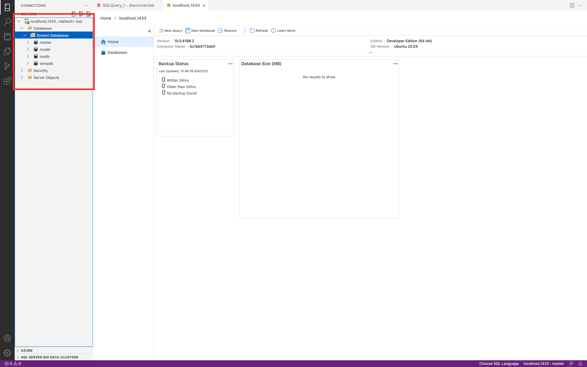

author: Brian Carranza, Douglas Hernández
summary: Guia de instalacion de Sql Server en Mac OS
id: install-sql-mac
tags: guide, install
categories: Instalacion
environments: Web
status: Published
feedback link: https://github.com/01-2022-Bases-de-datos-UCA/Codelabs/issues

# Instalando SQL Server en Mac OS con Docker

## Instalador (Docker)

Ir a a la página oficial de Docker: [Página oficial de Docker](https://docs.docker.com/desktop/mac/install/ )

Seleccionar y descargar el instalador compatible con el tipo de procesador que el dispositivo tenga. Puedes verificar el tipo de procesador en la opción “acerca de esta MAC".


Instalar Docker, puedes verificar las instrucciones de instalación en el mismo sitio web. La instalación requerirá que verifiques tu usuario y contraseña.


Al finalizar la instalación, abrir Docker. La primera vez, se solicitarán permisos para ejecutar la aplicación


El entorno inicial de Docker debería verse así


Ahora, es necesario dirigirse a la página web hubdocker desde el siguiente enlace: [Link hubdocker](https://hub.docker.com/), en esta página se encuentra la colección de contenedores del servicio Docker en su última versión.


## Microsoft SQL Server

En el buscador de hubdocker colocar: “Microsoft SQL Server”Copiar la cadena de descarga que aparece en la derecha.

```javascript
 docker pull mcr.microsoft.com/mssql/server 
```


Abrir una terminal del sistema operativo y pegar la cadena que se copió en el paso anterior, ejecutar y esperar a que la descarga del contenedor finalice


## Verificar instalación

Para verificar la instalación ir al gestor de Docker, y en la pestaña “images” debe mostrarse en la lista un elemento


Regresar a la terminal en donde se deberá ejecutar la siguiente cadena de código:

```javascript
 docker run -e "ACCEPT_EULA=Y" -e "SA_PASSWORD=ESCRIBIR_TU_CONTRASEÑA" -p 1433:1433 --name sqlserver_uca -d ID_DE_CONTENEDOR 
```

<aside class="positive">
<b>Importante:</b>
<li>En la opción “SA_PASSWORD”, cambiar el valor por tu propia contraseña, por reglas de SQL Server, la contraseña debe contener al menos 8 caracteres, por lo que se sugiere que guardes la contraseña en caso de que sea olvidada</li>
<li>En la opción “-d”, ir al gestor de docker y copiar el id del contenedor del SQL Server</li>
</aside>


Al ejecutar la cadena, el resultado debería ser como el siguiente


Para verificar el resultado exitoso de la operación anterior, ir al gestor Docker, luego en la pestaña “containers apps” verificar que existe un elemento llamado “slqserver_uca” con el estado “running”


## Descargar Azure Data Studio

Ahora se debe descargar el cliente que vamos a utilizar para acceder a SQL Server, para ello, ir al sitio web: [Download and install Azure Data Studio](https://docs.microsoft.com/en-us/sql/azure-data-studio/download-azure-data-studio?view=sql-server-ver15)


Descomprimir el archivo zip y ejecutar Azure Data Studio


En Azure Data Studio, ir a la opción “Connections”


En la ventana emergente, definir la información para poder conectarse al motor de SQL Server


Para confirmar que nos hemos conectado exitosamente al motor de SQL Server, podemos ir al directorio “database”, luego “system database”, y verificar que existan las siguientes 4 bases de datos por defecto.



## Autores

Autores:  
  **Versión 1:**
Brian Darwin Carranza Campos (00136020@uca.edu.sv), Douglas Hernández Torres (dohernandez@uca.edu.sv)  
  **Responsables:**
Erick Varela Guzmán (evarela@uca.edu.sv), Douglas Hernández Torres (dohernandez@uca.edu.sv), 
Correspondencia: evarela@uca.edu.sv

Departamento de Electrónica e Informática, Universidad Centroamericana José Simeón Cañas, La Libertad, El Salvador.

Versión de este documento: Versión 1, 2022.

 This work is licensed under a [Creative Commons Attribution-NonCommercial-ShareAlike 4.0 International License](http://creativecommons.org/licenses/by-nc-sa/4.0/).