author: Fatima Renderos.
summary: Modelo Relacional y Normalizado
id: laboratorio-02
tags: guide
categories: Relacional, Normalizado
environments: Web
status: Published
feedback link: http://google.com

# Modelo Relacional y Normalizado

## Modelo Relacional
Duration: 0:03:00

Tras ser postulado por Edgar Frank Codd en 1970, el modelo relacional se estableció
rápidamente como un paradigma importante en los modelos de bases de datos, actualmente, el más utilizado en la gestión de datos dinámicos.
La principal idea en la que se basa este modelo es el uso de **relaciones**. Consiste en el almacenamiento de datos en tablas compuestas por filas ( **tuplas**) y columnas ( **campos o atributos**). Es más sencillo de comprender para el usuario con poca experiencia y brinda algunas ventajas como:

* Evita la duplicidad de registros.
* Garantiza la integridad referencial.
* Facilita el proceso de normalización.
Es importante resaltar que el modelo relacional puede obtenerse de la conversión del **modelo entidad-relación**, eso sí, si el mismo fue bien planteado desde el principio.Cambiando la notación y aplicando ciertas reglas, el proceso
de conversión no debería representar mucha dificultad. 

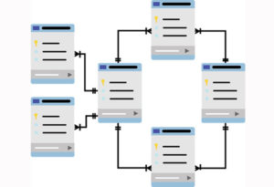

<aside class="positive">
De forma general, puede decirse que el modelo E-R es una técnica de diseño de bases de datos. Por su parte el modelo relacional es una formalización teórica de las bases de datos relacionales. 
</aside>

Los 3 aspectos más importantes al realizar la conversión:
* Atributos clave
* Cardinalidad
* Entidades fuertes y débiles

## Conversión Entidad-Relación a Relacional 
Duration: 0:03:00

Una vez abstraída la información en el modelo E-R, proceder a su conversión al modelo relacional puede pensarse en un modelo en la que toda la información, de entidades y relaciones, sea representada mediante **tablas**. Para esto, es necesario aplicar ciertas reglas de transformación. 

**Para este laboratorio nos auxiliaremos del diagrama entidad relación que es desarrollado en base a una Librería, que es un ejemplo del Laboratorio 1 y es el siguiente:** 

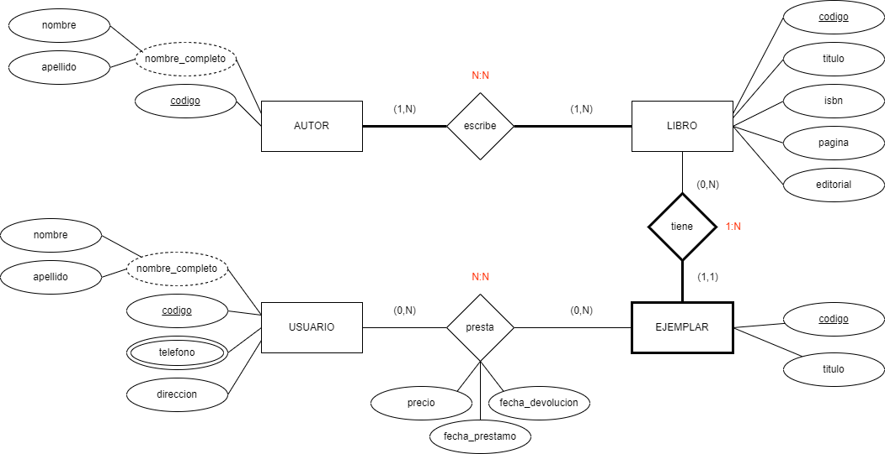

Para el siguiente diagrama se desarrollará lo siguiente:
* Diagrama Modelo Relacional
* Diagrama Relacional Normalizado

## Entidades Fuertes
Duration: 0:05:00

Las entidades fuertes son las que no dependen de ninguna otra para existir. Cada
columna representará un atributo y cada **tupla** (fila) representará una entidad en
particular. 

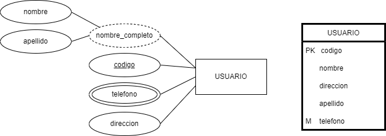

Los atributos se mantienen, incluyendo las claves primarias. Es recomendable
renombrarlos para evitar ambigüedades con otras tablas que tengas atributos similares,
precio (por ejemplo una tabla Profesor que también tienen nombre y teléfonos) aunque no es
absolutamente necesario para estos casos. Las claves primarias van siempre al
principio. 

## Conversión 1:N 
Duration: 0:08:00

Cuando se tiene una situación 1:N, la entidad del lado que tiene la **N** obtiene una copia
de la **clave primaria** de la otra entidad como atributo de sí misma, como en el siguiente
ejemplo.

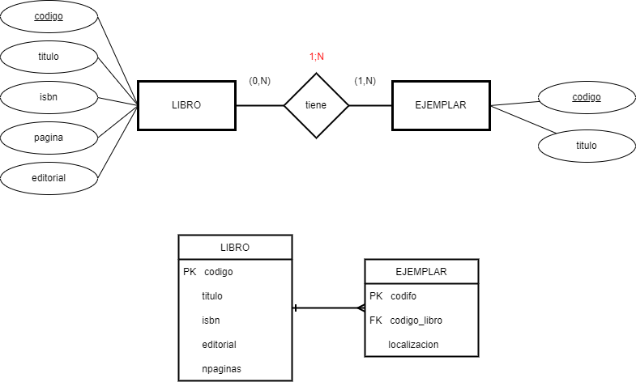

Como puede apreciarse, el **código del libro** pasa también como campo de la tabla
Ejemplar, a este campo se le conoce como **llave o clave foránea**. La relación desaparece visualmente, pero la cardinalidad se mantiene. Tiene sentido que esto ocurra, ya que un ejemplar, es una copia de un libro en específico.

<aside class="positive">
Las claves foráneas representan una relación directa con alguna entidad específica en otra tabla. En este caso, puede saberse de qué libro es cierto ejemplar observando el código de libro (FK). 
</aside>

## Conversión N:N
Duration: 0:08:00

Para este caso, la relación se vuelve una tabla que tendrá su propia clave primaria y las
claves primarias de las dos entidades involucradas, pero como claves foráneas.
Además de estas, pueden agregarse atributos que se consideren necesarios. Para este
caso se añadieron los campos de **fecha de préstamo y de devolución**, ya que aportan
información importante.

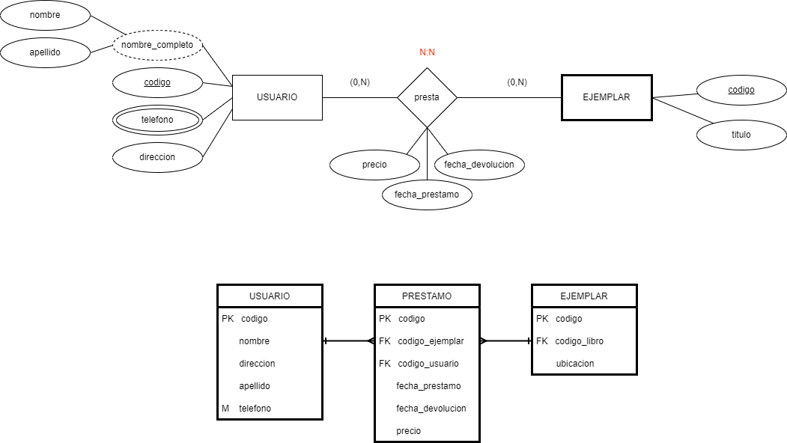

## Conversión 1:1 
Duration: 0:08:00

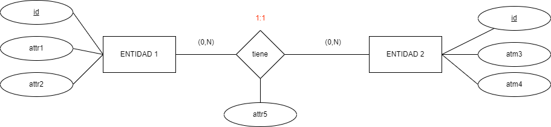

Usualmente la más sencilla, aunque tiene algunos casos especiales
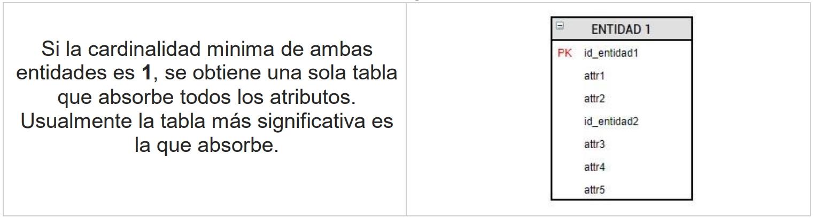
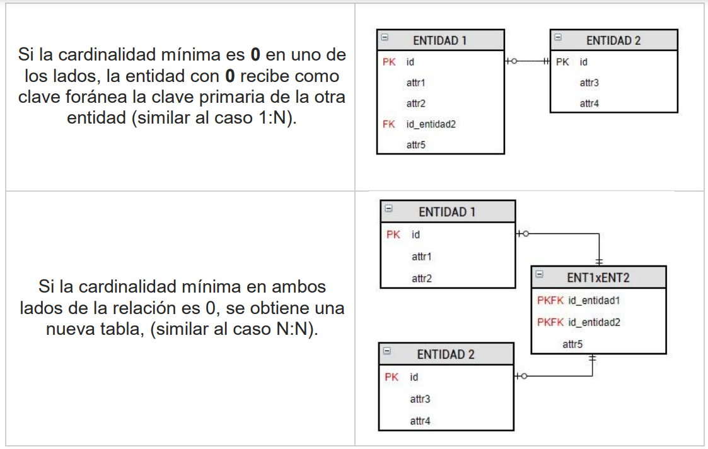

Aunque los últimos dos casos no son muy comunes, es importante conocerlos

## Normalización
Duration: 0:15:00

Se dice que una base de datos está normalizada si está libre deambigüedades e inconsistencias, es decir, permite tener un
conjunto adecuado de relaciones.

Si se ha diseñado correctamente el diagrama de la base desdeel principio, el proceso de normalización se facilita en gran
medida. Este proceso se lleva a cabo aplicando una serie dereglas conocidas como **formas normales**. 

<aside class="positive">
Se dice que una base de datos está en su “N forma normal” si todas sus tablas cumplen con las reglas de esa N forma normal 
</aside>

# **Primera forma normal**
La principal característica de esta forma se resume en que “cada intersección de fila y columna contiene exactamente un valor del dominio aplicable (y nada más)”. Es decir, no se permite almacenar **grupos de valores** para un solo registro. Usualmente esto ocurre cuando se han definido atributos multivaluados

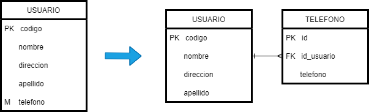

Como puede observarse, de esta forma pueden almacenarse cualquier cantidad de teléfonos para un usuario, sin necesidad de guardarlo directamente como un grupo. 

# **Segunda forma normal**

Como requisito, las tablas deben cumplir con la primera forma normal. Esta forma dice que todos los atributos que no son parte de la llave primaria, deben depender de toda la llave primaria y no solo parte de ella.

Visto de otra forma, si un atributo (no primario) está siendo redundante en los datos que almacena (se aplican a varios registros) probablemente está queriendo actuar de forma independiente y se deba formar una nueva tabla. Las tablas resultantes de esta forma suelen llamarse tablas **catálogo.**

Retomando el ejemplo para explicar esta situación: 

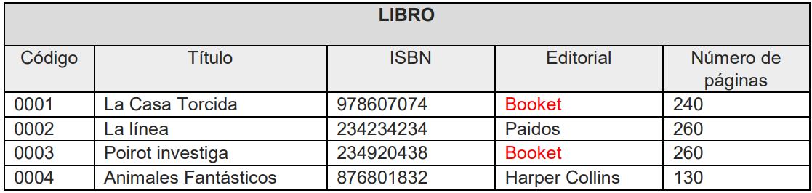

Como puede apreciarse en el ejemplo, si se necesita registrar más libros de la editorial Booket la tabla empezará a tener datos repetidos, al igual que con otras editoriales. Visto de otro modo, este campo puede actuar de forma independiente como una tabla.

Separando la editorial como una tabla y relacionando esta nueva tabla con una clave foránea, se resuelve el problema de redundancia

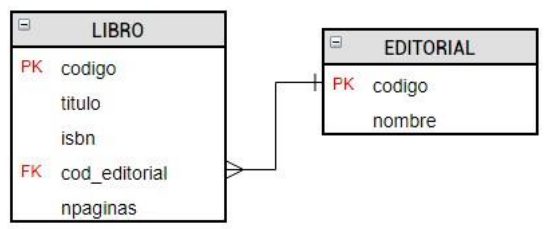
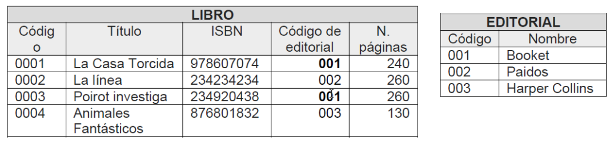

# **Tercera forma normal**

Una tabla está en tercera forma normal si no existe ninguna dependencia transitiva entre los atributos que no son clave. Además debe cumplir también con la 2FN. Un ejemplo sencillo se da en el siguiente caso, donde se tiene una tabla de eventos y el lugar donde se realizará cada uno. 

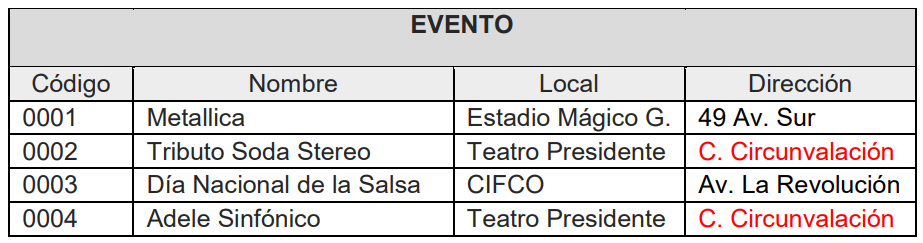

La 3F falla debido a que la dirección de local depende directamente del local y éste último no es un atributo clave. Esto puede llevar a problemas de actualización donde nada impide tener diferentes direcciones para el mismo local. Esto se resuelve fácilmente creando una nueva tabla que contenga este registro dependiente.

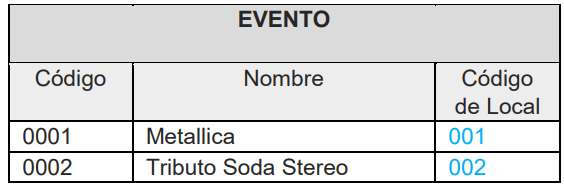

La idea final de la 3FN es separar los grupos de datos que tengan dependencias transitivas a tablas separadas e identificar cada grupo con una llave, tal como se ha logrado en el ejemplo anterior. 

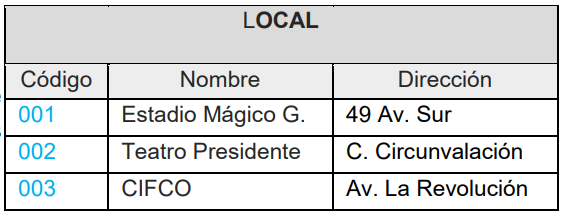

<aside class="positive">
Prestar atención a la dirección de las relaciones obtenidas de la 1FN y 2FN.
</aside>

## Ejercicio práctico 

Suponga que una importante compañía aérea le ha encargado el diseño de su base de datos. Realice el desarrollo de la solución tal como lo hicimos en el ejemplo (paso a paso). La descripción del escenario es el siguiente: Una importante compañía aérea necesita una base de datos para registrar la información de sus vuelos.

Los vuelos están caracterizados por una fecha y los aeropuertos de origen y destino, de cada aeropuerto es importante almacenar el nombre y la ciudad y país donde está ubicado. Notar que cada vuelo tiene relación con dos aeropuertos, uno funciona como origen y el otro como destino.

Cada vuelo es realizado por un avión. Los aviones tienen una matrícula que los identifica, el fabricante, un modelo e información sobre su capacidad (número máximo de pasajeros).

Los pasajeros para poder realizar una reserva, deben registrar su nombre, pasaporte, la fecha de nacimiento, un correo electrónico y el país de origen (nacionalidad). Registrados estos datos, la reserva se podrá registrar, en cada reserva se almacena el precio del servicio, la fecha en que fue realizada la transacción y el tipo de reserva (económica, ejecutiva, primera clase.

Opcionalmente, un cliente puede incluir servicios extra en cada reserva, como, por ejemplo: wifi satelital, seguros, maletas extra, transporte de mascotas, entre otros. De cada servicio extra, interesa almacenar el nombre del servicio y su precio.

# **Solución Ejercicio Practico**

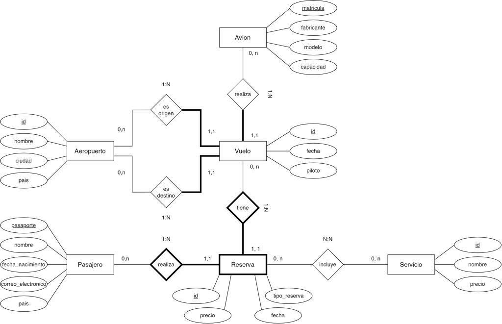

# **Tarea de Laboratorio 2**

Tomando como base la **solución** del diagrama E-R obtenido del ejercicio realizado de
la primera guía (compañía aérea), realizar su conversión:
* Diagrama Modelo Relacional
* Diagrama Relacional Normalizado (aplicar las 3 formas normales) 

## Sobre los autores de esta guía práctica

Autores:  
  **Versión 1:**
Emerson Gamaliel Nolasco (00215316@uca.edu.sv), Kevin Enmanuel Velásquez (00018616@uca.edu.sv)      
  **Versión 2:** 
Fátima Adriana Renderos (00064018@uca.edu.sv)  
  **Versión 3:**
Brian Darwin Carranza Campos (00136020@uca.edu.sv), Fátima Adriana Renderos (00064018@uca.edu.sv)   
  **Responsables:**
Erick Varela Guzmán (evarela@uca.edu.sv), Douglas Hernández Torres (dohernandez@uca.edu.sv), 
Correspondencia: evarela@uca.edu.sv

Departamento de Electrónica e Informática, Universidad Centroamericana José Simeón Cañas, La Libertad, El Salvador.

Versión de este documento: Versión 3, 2022.

 This work is licensed under a [Creative Commons Attribution-NonCommercial-ShareAlike 4.0 International License](http://creativecommons.org/licenses/by-nc-sa/4.0/).