author: Alejandro Cerón, Moises Rosales
summary: Definición de SQL, DDL y DML
id: laboratorio-03
tags: guide
categories: SQL, DDL, DML
environments: Web
status: Published
feedback link: https://github.com/01-2022-Bases-de-datos-UCA/Codelabs/issues


# Definición de SQL, DDL y DML


## ¿Qué es SQL y por qué es importante conocerlo?
Duration: 0:1:00


SQL (Structured Query Language o Lenguaje de Consulta Estructurado) es un lenguaje
de programación estándar utilizado para la manipulación de bases de datos
relacionales, que permite realizar diversos tipos de operaciones en ellas. En este
laboratorio aprenderá DDL (Lenguaje de Definición de Datos) y DML (Lenguaje de
Manipulación de Datos).


## Conozcamos el IDE
Duration: 0:3:00


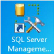

SQL Server Management Studio (SSMS) es un ambiente de trabajo para
estructuras SQL, provee de herramientas para configurar, monitorear y
administrar bases de datos.
Encienda la máquina virtual y busque este icono en el escritorio.

Al entrar en la aplicación, aparecerá esta pantalla, dar al botón “Conectar”.


Lo que verá es una pantalla así:

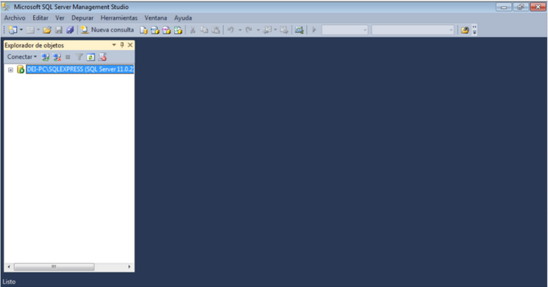


En los laboratorios anteriores se han realizado los procesos iniciales de creación de una
base de datos, el siguiente paso después de tener el diagrama totalmente normalizado,
es el de crear la base datos, junto a todas sus tablas y definir sus atributos.


## Creación de nueva base de datos
Duration 0:04:00


Hay dos opciones para crear una nueva base, la primera es solo con el ratón: desplegar
la instancia creada al iniciar la aplicación y buscar la carpeta Bases de datos, dar con el
botón derecho sobre la carpeta y elegir la opción “Nueva base de datos”.

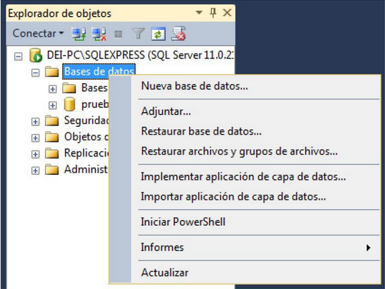


Desplegará otra pantalla en la que requerirá de un nombre para la nueva base, puede
ponerle el nombre que desee, en esta ocasión se nombra “Labo3”, luego dar clic al botón
“Aceptar”, por el momento los parámetros de configuración de esta ventana se dejarán
con sus valores por defecto.

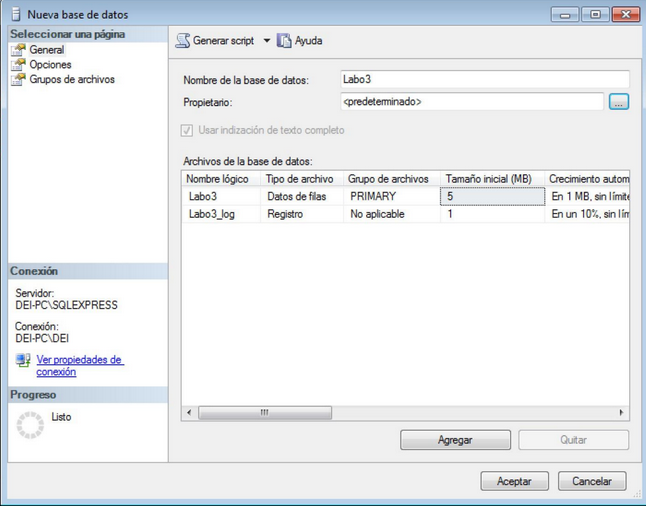


Presionar botón derecho sobre el servidor activo (Con el icono de play verde) y buscar
la opción “Actualizar” en el menú, debería aparecer la nueva base de datos en la lista
disponible.

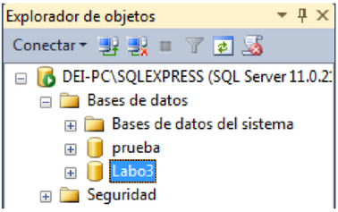


La otra opción para crear una base es utilizando sentencias DDL SQL.


## DDL y DML
Duration: 0:04:00

**DDL**

Las sentencias DDL se utilizan para crear, modificar la estructura, de las tablas y objetos
de la base de datos. Por ejemplo:

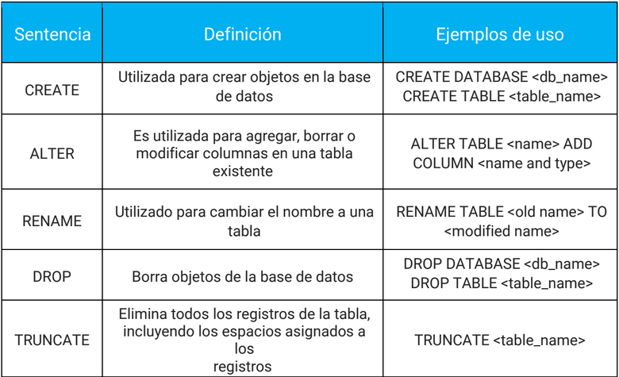


**DML**

Las sentencias DML son utilizadas para gestionar datos dentro de las tablas. Por
ejemplo:

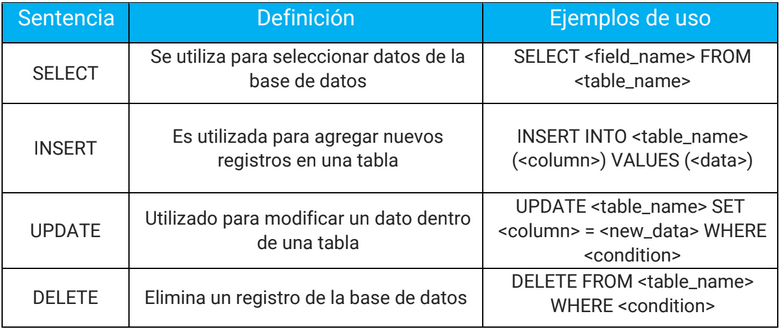


## Creación de una base de datos
Duration 0:08:00


Los pasos para crear la base con comandos son los siguientes:

Crear un nuevo archivo de consultas, dando clic en el botón que dice “Nueva consulta”
(El que está al lado del botón para guardar).

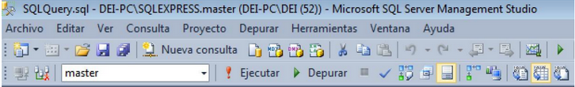


Preguntará a que servidor queremos relacionar la consulta, se utiliza el servidor por
defecto, no cambiamos nada, dar clic al botón “Conectar”.

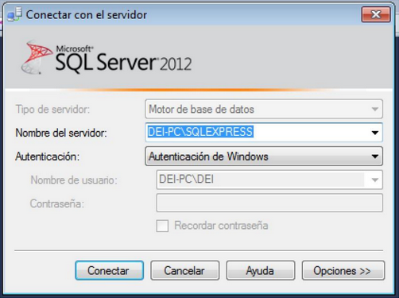


Tendremos una página en blanco en la que escribiremos las sentencias para la creación
de la nueva Base de Datos. Se utiliza el comando CREATE.

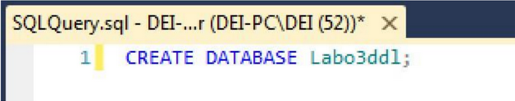


Sombrear el comando CREATE y en la barra superior, buscar el botón con un signo de
admiración que dice “Ejecutar”, presionarlo y esperar el mensaje “Comandos
completados correctamente” en la ventana Mensajes.

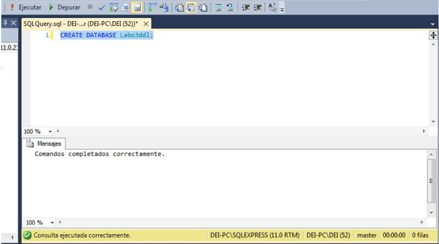


Después de actualizar el servidor, debería aparecer la nueva base de datos en la lista
disponible.

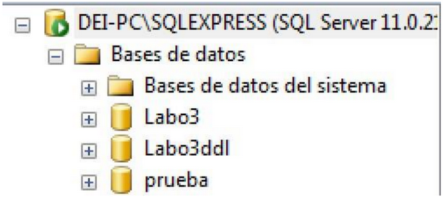


¡Listo! la base de datos ha sido creada.

Se procede a crear las tablas y definir los atributos para cada una, se utilizará el
siguiente diagrama relacional normalizado como ejemplo:

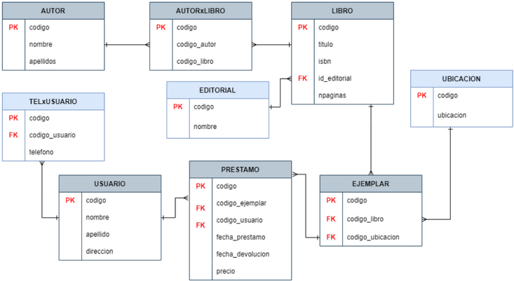


Antes de empezar con la creación de todos los objetos que utilizaremos, debemos
indicarle al IDE que usaremos nuestra base de datos Labo3 con la instrucción USE:

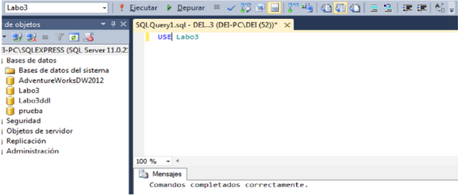


O bien podemos seleccionarla con el indicador del IDE:

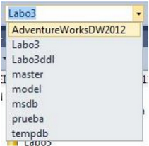


## Creación de objetos de bases de datos
Duration: 0:22:00


### **TABLAS**

Utilizaremos el comando CREATE TABLE donde colocaremos los campos a utilizar.
Ejemplo:

```
CREAETE TABLE LIBRO (
    codigo int primary key not null,
    titulo varchar(50),
    isbn varchar(30),
    npaginas INT,
    id_editorial int
);

CREATE TABLE EDITORIAL (
    codigo int primary key not null,
    nombre varchar(50)
);
```

Note que podemos colocar la llave primaria desde la creación de la tabla usando las
palabras reservadas “primary key” en el atributo clave, y colocamos también la
condición
‘not null’. (En clase se han visto dos formas más para configurar las llaves primarias
¿Cuales son?).


### **LLAVES PRIMARIAS Y FORÁNEAS**

Las llaves primarias son el atributo clave de la tabla, sin ella, los datos estarían
desordenados y sin un índice que los identifique, de esto se puede asumir que la llave
primaria no puede ser nula. Para crear llaves primarias desde la creación de la tabla se
usará el siguiente ejemplo:

```
CREATE TABLE AUTORXLIBRO (
    codigo int identity primary key not null,
    codigo_autor int,
    codigo_libro int
);
```

Las llaves foráneas son importantes para la relación de tablas en la base de datos ya
que nos permitirán hacer consultas cruzando tablas y obteniendo campos de ambas
partes.

En el siguiente ejemplo veremos la creación de las llaves foráneas desde la creación de
la tabla, pero es recomendable hacerlo en un comando aparte, con un CONSTRAINT
pues le asignamos un nombre a esta relación en caso de querer borrarla luego:

```
CREATE TABLE AUTORXLIBRO (
    codigo int identity primary key not null,
    codigo_autor int,
    codigo_libro int FOREIGN KEY (codigo_libro) REFERENCES LIBRO (codigo)
);
```

<aside class="positive">
No es necesario que los campos referencia y referenciado tengan el mismo
nombre, pero sí es requisito que dispongan del mismo tipo de dato.
</aside>


### **ALTER TABLE**

En el caso de haber cometido un error al crear la base de datos, olvidar algún atributo,
llave primaria o tipo de dato erróneo, puede modificar las propiedades de la tabla con
esta instrucción.
En el caso de haber olvidado colocar la llave primaria, se puede solventar con el
siguiente ejemplo:

```
ALTER TABLE AUTORXLIBRO
ADD PRIMARY KEY (codigo);
```

También puede agregar la llave foránea después de haber creado las tablas:

```
ALTER TABLE AUTORXLIBRO
ADD CONSTRAINT FK_AUTORXLIBRO_AUTOR
FOREIGN KEY (codigo_autor) REFERENCES AUTOR (codigo);
```
Al olvidar colocar algún campo, puede ser resuelto de la siguiente forma:

```
ALTER TABLE AUTORXLIBRO
ADD campo_olvidado char(5);
```
Si se colocó el tipo de dato erróneo en una columna:

```
ALTER TABLE AUTORXLIBRO
ALTER COLUMN campo_olvidado int;
```


### **INSERT**

Ahora insertamos datos a las tablas que creamos con la sentencia INSERT y los
nombres de las columnas que queremos insertar:

```
INSERT INTO LIBRO (codigo, titulo, isbn, npaginas, id_editorial)
  VALUES (1, 'Asedio y Tormenta', '010-1', 544, 002),
    (2, 'Siempre Alice', '011-2', 300, 004),
    (3, 'Corazon de Tinta', '012-3', 500, 005);

INSERT INTO EDITORIAL (codigo, nombre)
  VALUES (002, 'Hidra'),
    (004, 'Ediciones B'),
    (005, 'Scholastic Corporation');
```

Cuando se insertan los datos, hay que respetar los tipos, en los campos cuyo tipo es
varchar se tienen que agregar los datos encerrados en comillas ‘simples’.
También puedes agregar datos a tus tablas aunque no especifiques los campos,
siempre y cuando insertes todos los campos en el orden en el que están guardados en
la tabla. Por ejemplo, agregaremos los datos de un nuevo libro:

```
INSERT INTO LIBRO VALUES (5, 'La Huesped', '010-4', 644, 002);
```


### **SELECT**

Para verificar que las tablas fueron modificadas, utilizamos la sentencia SELECT, en
este ejemplo le decimos que nos muestre todos los datos:

```
SELECT * FROM LIBRO;
```

El resultado será el siguiente:

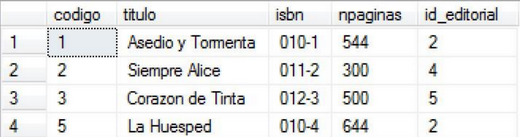

Los SELECT también pueden mostrarnos columnas específicas, solo se sustituye el
asterisco por el nombre de la columna que se quiere consultar.

```
SELECT titulo FROM LIBRO;
```

El resultado debe verse algo así:

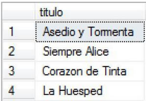


### **UPDATE**

Esta sentencia se utiliza para actualizar un registro de una tabla, es preferible utilizar la
sentencia WHERE junto a la llave primaria para especificar qué registro queremos
actualizar. Actualicemos el libro con código 2 y cambiemos el número de páginas a 800:

```
UPDATE LIBRO SET npaginas=800
  WHERE codigo=2;
```

<aside class="positive">
¿Qué pasaría si no utilizamos el WHERE?
</aside>


### **DELETE**

Esta sentencia se utiliza para borrar un registro de una tabla, para esto necesitamos
saber la llave primaria del registro a eliminar, puede utilizarse otro campo pero no es
recomendado pues podemos borrar muchos datos de una vez, para este ejemplo
borraremos el libro “Siempre Alice”, cuya llave primaria es el número 2:

```
DELETE FROM LIBRO WHERE codigo=2;
```
Si realizamos un SELECT a la tabla LIBROS veremos que el campo ha sido eliminado.

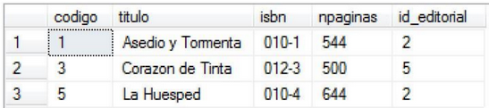

<aside class="positive">
Es importante que no olvidemos la sentencia WHERE ¿Qué pasaría si no la escribimos?
</aside>


### **DROP**

Para terminar de estudiar las sentencias, utilizaremos el comando DROP para borrar la
base de datos que no estamos usando actualmente y que creamos al principio del
laboratorio.

```
DROP DATABASE Labo3ddl;
```

Actualizamos el servidor activo, siguiendo los mismos pasos que se utilizaron para ver
la nueva base cuando fue creada.


## Tarea


Utilizando el Diagrama Relacional Normalizado entregado en la tarea del laboratorio 2, escribir
los comandos para:

1. Crear las tablas
2. Crear las llaves primarias (PK) y foráneas (FK) correspondientes a cada tabla,
3. Introducir en cada tabla al menos 5 filas.

Si tienes consultas de los tipos de datos, ve al apéndice 1. Se deberá subir un archivo .sql según
las indicaciones de los instructores encargados.

Para facilitar el trabajo, puedes basarte en el siguiente diagrama solución:

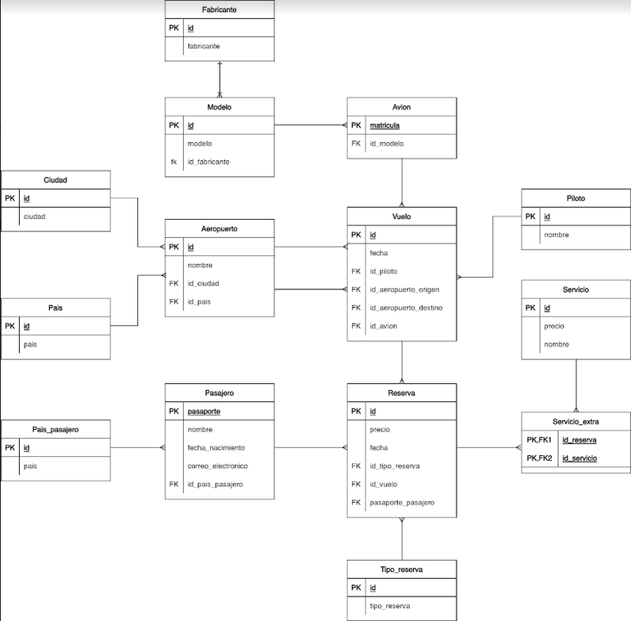


## Apéndice 1: Tipos de Datos


Hay que tener en cuenta los tipos de datos que usaremos para cada campo, así que se
listaran los más utilizados para tener algunas nociones:

Numéricos:


Al tipos de dato int se le puede colocar un modificador identity con el cual podemos hacer un autoincremento de valor. Podemos usarlo en las llaves primarias por ejemplo. 

¿Qué tipo de dato utilizaría usted para la edad de una persona?

Cadenas de texto:

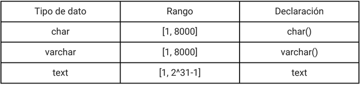

¿Cuál es la diferencia entre Char y Varchar?

Fecha:

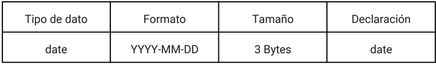
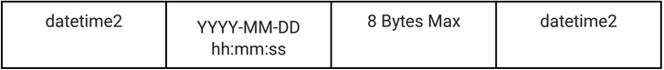


## Sobre los autores de esta guía práctica

Autores:  
  **Versión 1:**
Emerson Gamaliel Nolasco (00215316@uca.edu.sv), Kevin Enmanuel Velásquez (00018616@uca.edu.sv)      
  **Versión 2:** 
Fátima Adriana Renderos (00064018@uca.edu.sv)  
  **Versión 3:**
Alejandro Ernesto Cerón Lemus (00040116@uca.edu.sv), Moisés Daniel Rosales Galindo (00218916@uca.edu.sv)    
  **Responsables:**
Erick Varela Guzmán (evarela@uca.edu.sv), Douglas Hernández Torres (dohernandez@uca.edu.sv), 
Correspondencia: evarela@uca.edu.sv

Departamento de Electrónica e Informática, Universidad Centroamericana José Simeón Cañas, La Libertad, El Salvador.

Versión de este documento: Versión 3, 2022.

 This work is licensed under a [Creative Commons Attribution-NonCommercial-ShareAlike 4.0 International License](http://creativecommons.org/licenses/by-nc-sa/4.0/).