author: Karla Aguilar, Alejandra Marroquín
summary: Consultas simples con select y Joins
id: laboratorio-04
tag: guide
categories: Select, Join
environments: Web
status: Published
feedback link: https://github.com/01-2022-Bases-de-datos-UCA/Codelabs/issues

# Consultas simples con SELECT y Joins

## Consultas SQL (SELECT)

La sentencia SELECT es una sentencia DML (Lenguaje de Manipulación de Datos) utilizada para seleccionar datos de una base de datos, es también conocida como consulta de selección.

## Estructura del SELECT

La sintaxis básica de una consulta de selección es la siguiente:

    SELECT [CAMPOS] FROM [TABLA] [WHERE[CONDICION]];

En donde [CAMPOS] son los atributos o columnas que se desean extraer de la [TABLA]
que se especifique y [WHERE] es opcional, esta condición será utilizada más adelante.

Consideremos la siguiente base de datos:

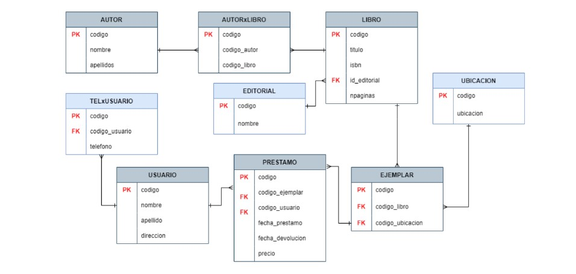

Si se quiere extraer solamente el nombre y apellido de la tabla USUARIO se hace de la
siguiente manera:

    SELECT nombre, apellido FROM usuario;

Dando como resultado:

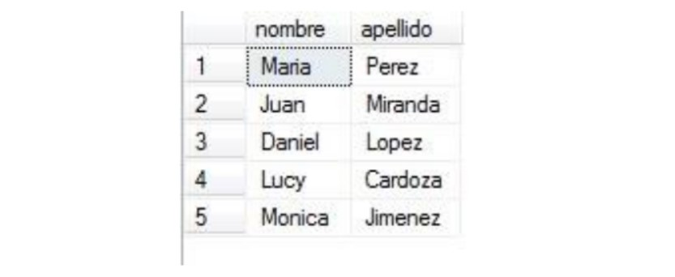

Si se desea extraer todos los campos de una tabla se utiliza * de la siguiente manera:

    SELECT * FROM usuario;

Esta instrucción devolverá todos los registros y todos los campos que la tabla posea.

## ALIAS (AS)

En muchos casos es necesario asignar un nombre a alguna columna o tabla, cuando se le asigna un alias a una columna el nombre de la columna cambia en el resultado, mientras que cuando se usa el alias en la tabla este sirve para identificar campos que tengan el mismo nombre en distintas tablas.
Por ejemplo se desea extraer todos los nombres de la tabla AUTOR y todos los nombres de la tabla USUARIO, pero que al mostrarse se llamen Nombres de Autores y Nombres de Usuarios; *¿Qué problema habría si se quita el alias a las tablas?*

    SELECT u.nombre as "Nombre usuario", a.nombre as "Nombre autor" FROM usuario as u, autor as a;

*¿Por qué el resultado de esta consulta está lleno de duplicidad?*

## Cláusula condicional WHERE

Esta cláusula devuelve un subconjunto de los registros de una tabla que cumplan con
dicha condición.

    SELECT * FROM LIBRO WHERE npaginas = 300;

Esta consulta devuelve los registros de la tabla LIBRO que cumplan la condición de tener
300 páginas.

Otros operadores que se pueden usar en la cláusula WHERE:

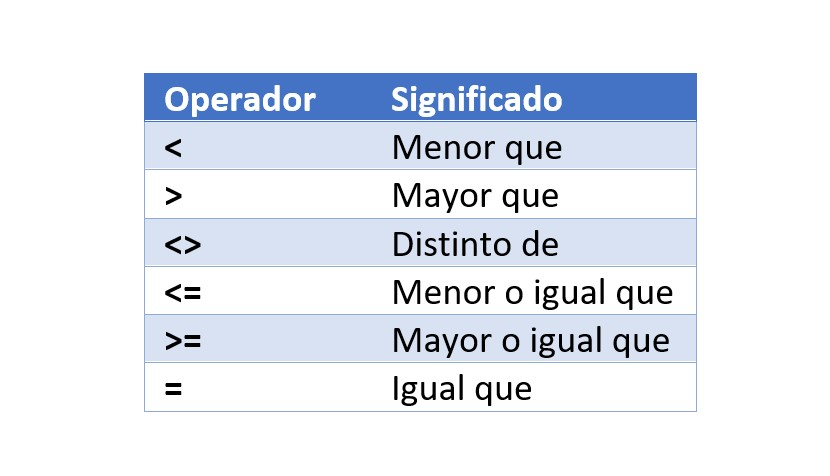

Además de estos operadores lógicos se disponen otros adicionales:

### BETWEEN

Indica un intervalo de valores:

    SELECT * FROM LIBRO WHERE npaginas BETWEEN 1 AND 500;

Esta instrucción devuelve los registros de la tabla LIBRO que tengan entre 1 a 500 páginas.

### LIKE
Sirve para comparar patrones de texto:

    SELECT * FROM autor WHERE nombre LIKE '1%';

Devuelve todos los autores cuyo nombre comience con “L”.

[Lista de patrones de texto](https://www.w3schools.com/sql/sql_wildcards.asp)

### IN

Sirve para comparar con una lista de valores fijos:

    SELECT num, calle, direccion
    FROM direccion
    WHERE ciudad IN ('Sevilla', 'Córdoba', 'Huelva', 'Cádiz')

### IS NULL/ IS NOT NULL

Devuelve los registros que sean o no sean nulos. Este operador lógico se verá más adelante cuando se trabajen los JOINS.

### Operadores lógicos

Sirven para componer expresiones y filtrar aún más los registros de una tabla.

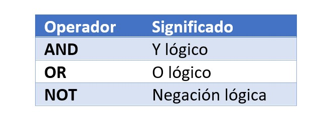

    SELECT * FROM Libro WHERE npaginas > 550 AND titulo LIKE 'a%';

Esta consulta devuelve los registros de la tabla libro que tengan más de 550 páginas y el título comience con la letra a.

## Consultas entre tablas JOIN

Se pueden generar consultas en las cuales es necesario obtener datos de varias tablas relacionadas entre sí.
La forma básica de hacerlo es utilizando la cláusula condicional WHERE también conocido como INNER JOIN implícito:

    SELECT l.titulo FROM libro as l, ejemplar as e
    WHERE l.codigo = e.codigo_libro;

A continuación se verán los principales tipos de JOINS. Imágenes cortesía de Steve Stedman.

### INNER JOIN

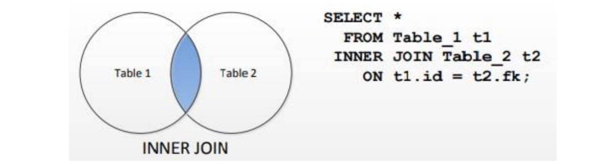

Esta consulta obtiene lo mismo que el JOIN implícito

### LEFT JOIN

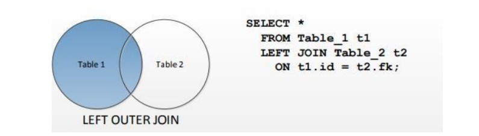

El resultado de esta consulta contiene todos los registros de la relación izquierda (primera tabla indicada) y aquellos de la tabla derecha que cumplen la condición, para los demás aparecerá en los campos correspondientes un NULL.

### RIGHT JOIN

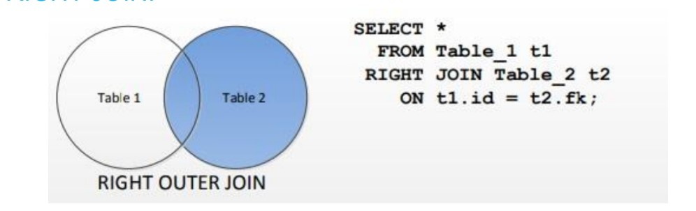

Es análogo al LEFT JOIN, pero devolviendo todos los registros de la relación derecha (segunda tabla que aparece), y únicamente aquellos de la tabla izquierda que cumplen la condición del JOIN. Y aquellos sin equivalente en la parte izquierda tendrán en los campos correspondientes a dicha tabla un NULL.

### TWO INNER JOINS

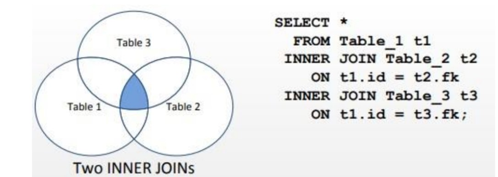

### EJEMPLOS

**Ejemplo 1:** Mostrar los libros que no han sido prestados en los últimos 6 meses.

    SELECT l.titulo,p.fecha_prestamo FROM libro as l 
    INNER JOIN Ejemplar as e ON l.codigo = e.codigo_libro 
    INNER JOIN Prestamo as p ON e.codigo = p.codigo_ejemplar
    WHERE fecha_prestamo NOT BETWEEN CAST('2018-12-12' AS DATE) AND CAST('2019-05-05' AS DATE);

**Ejemplo 2:** Mostrar que libros ha prestado el usuario Sara.

    SELECT u.nombre AS Usuario, L.titulo AS Libro FROM Usuario as U INNER JOIN Prestamo P
    ON U.codigo = P.codigo_usuario INNER JOIN Ejemplar E
    ON E.codigo = P.codigo_ejemplar INNER JOIN Libro as L
    ON L.codigo = E.codigo_libro WHERE U.nombre='Daniel';

## EJERCICIOS

  **Ejercicio 1.**

Los clientes VIP tienen acceso a una serie de servicios adicionales en los distintos aeropuertos que visitan, por lo que se solicita que defina la lista de clientes VIP.

El criterio de evaluación consiste en verificar que el promedio de las reservas realizadas por un cliente sea mayor a 1799.00.

En la evaluación se debe tener en cuenta todos los servicios extra que incluyan los clientes en las reservas.

**Restricción :**
El ejercicio debe realizarse en una consulta SELECT, sin utilizar la sentencia INTO, tablas temporales o bloques de programación (bloques anónimos, funciones o procedimientos almacenados).

**Resultado esperado:**

  **Ejercicio 2.**

Cada reserva tiene una fecha en la que fue realizada, una solicitud del departamento de finanzas del consorcio requiere la ganancia del mes de abril de 2021, pero los datos deben estar organizados por días.
Como parte de la solicitud, se requiere que la fecha sea mostrada en un formato especial (ver imagen de vista esperada).

Para calcular el valor de una reserva se debe tomar en cuenta tanto el precio de la reserva como la suma de todos los servicios extras incluidos.

**Restricción :**
El ejercicio debe realizarse en una consulta SELECT, sin utilizar la sentencia INTO, tablas temporales o bloques de programación (bloques anónimos, funciones o procedimientos almacenados).

**Sugerencia :**
Investigar sobre la instrucción CONVERT y su utilización en la instrucción SELECT.

**Sección del resultado esperado (El resultado contiene más filas)**

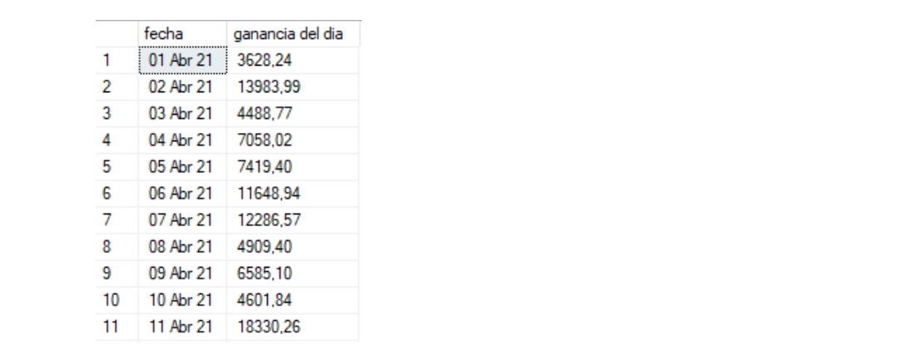

  **Ejercicio 3.**

La legislación internacional exige incluir un impuesto que depende de la clase seleccionada para cada reserva, la distribución actual impone los siguientes porcentajes:

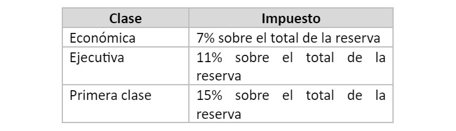

Por lo que se requiere mostrar las reservas realizadas, pero incluyendo el precio de cada reserva más el impuesto aplicado según la clase. Se deben mostrar los siguientes campos: el id de la reserva, la fecha, el id de la clase, el nombre de la clase, el total de la reserva sin impuesto aplicado y el total con el impuesto aplicado. Debe recordar que el total de la reserva se define a partir del precio de la reserva más la suma de todos los servicios extras incluidos.

**Restricciones :**
El ejercicio debe realizarse en una consulta SELECT, sin utilizar la sentencia INTO, tablas temporales o bloques de programación (bloques anónimos, funciones o procedimientos almacenados).

**Sugerencia :**
Investigar sobre la instrucción CASE y su utilización en la instrucción SELECT.

**Nota :**
El total de cada reserva se calcula de la siguiente forma: costo de la reserva + (suma de todos los servicios extra contratados). Tener en cuenta que no todas las reservas incluyen servicios extras.

**Sección del resultado esperado (el resultado contiene más filas):**

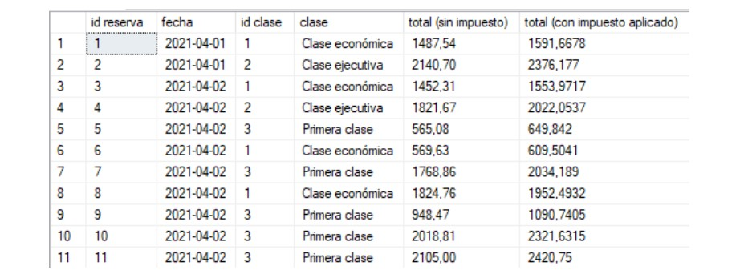

## Sobre los autores de esta guía práctica

Autores:

  **Versión 1:**
  
  Emerson Gamaliel Nolasco (00215316@uca.edu.sv), Kevin Enmanuel Velásquez (00018616@uca.edu.sv)
  
  **Versión 2:**
  
  Fátima Adriana Renderos (00064018@uca.edu.sv)  
  
  **Versión 3:**
  
  Karla Marielos Aguilar (00078913@uca.edu.sv), Alejandra Mabel Marroquín (00007415@uca.edu.sv)  
  
  **Responsables:**

Erick Varela Guzmán (evarela@uca.edu.sv), Douglas Hernández Torres (dohernandez@uca.edu.sv),
Correspondencia: evarela@uca.edu.sv

Departamento de Electrónica e Informática, Universidad Centroamericana José Simeón Cañas, La Libertad, El Salvador.

Versión de este documento: Versión 3, 2022.

 This work is licensed under a [Creative Commons Attribution-NonCommercial-ShareAlike 4.0 International License](http://creativecommons.org/licenses/by-nc-sa/4.0/).
