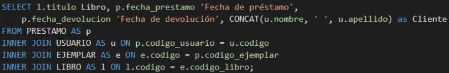

author: Fatima Renderos y Josué Cortez
summary: Procedimientos almacenados y Funciones
id: laboratorio-05
tags: guide
categories: Procedimientos almacenados y Funciones
environments: Web
status: Published
feedback link: https://github.com/01-2022-Bases-de-datos-UCA/Codelabs/issues

# Procedimientos Almacenados y Funciones

## Procedimientos almacenados
Duration: 0:08:00

Un procedimiento almacenado, o stored procedure en inglés, es un conjunto de
sentencias SQL, al cual se le asigna un nombre y se almacena como un objeto en el
servidor de la base de datos, de manera que este pueda ser reutilizado y compartido con
diferentes programas.
Al ejecutar un procedimiento por primera vez, SQL Server un plan de ejecución y lo guarda
en el plan cache, de forma que en ejecuciones futuras se pueda reutilizar dicho plan y el
procedimiento se realice muy rápido con rendimiento confiable.

**Ventajas**
* Reducción del tráfico en la red
* Encapsula lógica de negocio
* Añade seguridad para proteger contra ataques de SQL Injection
* Mantenibilidad

**Sintaxis:**

La información que se encuentra entre corchetes es opcional. La notación “**, … n**” indica
que esa instrucción se puede repetir una o más veces. De esta manera podemos decir
que el procedimiento puede recibir más de un parámetro y que puede ejecutar más de
una sentencia SQL. Además, podemos ocupar “**OR ALTER**” para modificar el procedimiento
si ya existe.
Ocupando la base de datos de la biblioteca, queremos una lista de los libros prestados,
con su fecha de préstamo, su fecha de devolución y el nombre completo del usuario al
que se le hizo el préstamo. Si prestamos atención, la información que queremos es una 
consulta que hace JOIN entre cuatro tablas, por lo que escribir esa consulta una y otra
vez puede ser tedioso y poco práctico. En lugar de eso, podemos generar un
procedimiento almacenado que se encargue de eso por nosotros. La consulta del JOIN:

Lo único que debemos hacer en este caso es ingresar esa sentencia SQL de consulta en
nuestra definición de procedimiento. Así:

Ahora que tenemos nuestro procedimiento, la forma de mandarlo a llamar es:

`EXEC nombre_procedimiento`

El cual en nuestro caso sería `EXEC listaPrestamoUsuarioLibro.`

### Parámetros

Como ya se mencionó, se pueden agregar varios parámetros a los procedimientos, pero
además de eso se pueden definir también como parámetros de salida, de forma que se
puedan almacenar en variables que declaremos.

Podemos observar que al parámetro cantidad después de su tipo de dato le
especificamos que es de salida con “OUTPUT”. Luego vemos como la última sentencia
SQL es una consulta en la que asignamos el valor de @@ROWCOUNT al parámetro de
salida cantidad.

<aside class="positive">
En T-SQL, @@ROWCOUNT es una variable global que el servidor modifica. Esta
variable devuelve un entero que significa el número de filas que fueron afectadas en
la sentencia SQL ejecutada previamente. Esto puede ser un INSERT, UPDATE,
DELETE O SELECT. 
</aside>

Ahora, para ejecutar nuestro procedimiento:

Es importante destacar que para que estas instrucciones funcionen, debe seleccionarse
todo desde la instrucción **DECLARE** hasta **SELECT @count;** y ejecutarse todo al mismo
tiempo.

### Estructuras de control

#### IF…ELSE

T-SQL también nos permite utilizar estructuras de control de selección, como lo son if y
else

**Ejemplo:**

#### WHILE

De igual forma, podemos hacer estructuras de control iterativas. La sintaxis:

**Ejemplo:**

Este ejemplo imprime en pantalla los 10 primeros números calculados de la serie de
Fibonacci.
Tanto dentro de los procedimientos almacenados como de las funciones, pueden
utilizarse estructuras de control para añadir lógica a conveniencia, como se mostrará
más adelante.

## Funciones
Duration: 0:08:00

De forma similar a los procedimientos almacenados, las funciones son conjuntos de
sentencias SQL que se almacenan como objetos en la base de datos que suelen
encapsular procesos lógicos para su reutilización.
Sin embargo, la principal diferencia con los procedimientos almacenados es que es
obligatorio que las funciones devuelvan un valor, al contrario de los procedimientos que
pueden o no tener valores de retorno. Otras diferencias entre procedimientos y funciones
son:
* Las funciones pueden tener sólo parámetros de entrada, mientras que los
procedimientos pueden tener de entrada y salida.
* Las funciones pueden ser llamadas desde un procedimiento, pero no se puede
llamar un procedimiento desde una función.
* Las funciones escalares pueden usarse como campo en una consulta.
* Sólo se permiten instrucciones de consulta, no es posible insertar, actualizar o
eliminar datos de tablas.

Existen 2 tipos principales de funciones. Las **funciones escalares** que devuelven un único
valor y las **funciones de tabla**, que retornan tablas generadas dentro de la misma.

### Funciones Escalares

Las funciones escalares reciben varios parámetros y devuelven un único valor. Sintaxis:

Como puede observarse, la sintaxis en muy similar a la de un procedimiento, con algunas
diferencias: los parámetros (que serán únicamente de entrada) van encerrados en
paréntesis. RETURNS indica el tipo de dato que se devolverá y RETURN devuelve el valor
en sí. De igual forma como con procedimientos, se puede sustituir CREATE por ALTER
para modificar la función una vez haya sido creada.
A continuación, algunos ejemplos de funciones, siempre sobre la base de datos de la
biblioteca.

**Ejemplo**

Dado el código de un libro, se desea obtener el total recaudado por los prestamos de sus
ejemplares. Si el código dado no existe, devolver -1.

Como puede observarse, dentro de las funciones pueden incluirse estructuras de
control para añadir lógica según convenga.

<aside class="positive">
Prestar atención a que RETURNS no es igual a RETURN.
RETURNS especifica el tipo de dato que la función va devolver, que puede ser
cualquiera de los tipos validos en SQL Server. RETURN es el que devuelve el valor.
</aside>

Para ejecutar la función una vez creada:

Las funciones brindan la posibilidad que pueden ser incluidas en una consulta como si
de otra columna se tratara. Si se quisiera obtener el total recaudado de cada uno de los
libros, se puede ejecutar:

De esta forma veríamos cada uno de los títulos registrados junto a su total recaudado

### Funciones de tabla

Este tipo de funciones brinda como valor de retorno una tabla generada dentro de la
misma. Estas brindan la posibilidad de incluir estructuras de control como IF o WHILE.
Pueden ser utilizadas en el FROM de una consulta y también en las sentencias JOIN.
Para ejemplo, se puede recrear el ejemplo hecho en la parte de Procedimientos, pero
ahora como una función que devuelve una tabla.

La tabla generada por esta función puede ser generada total o parcialmente, de la
siguiente forma:

Asimismo, la tabla generada puede ser tomada para sentencias JOIN.

## Tarea

**Diagrama de la base de datos**

### Ejercicio 1

Crear una función que reciba como parámetros 2 fechas y que retorne una tabla. La función
deberá retornar el detalle de los vuelos en ese rango de fechas, incluyendo el nombre de
los aeropuertos de destino y origen, así como el avión que se utilizará para realizar el vuelo.

**Sección del resultado esperado si se ingrese las fechas '01/05/2021' y
'06/05/2021' cómo parámetros de entrada:**

### Ejercicio 2

Los clientes VIP tienen acceso a una serie de servicios adicionales en los distintos
aeropuertos que visitan, por lo que se solicita que defina la lista de clientes VIP.
El criterio de evaluación consiste en verificar que el promedio de las reservas realizadas
por un cliente sea mayor a 1799.00. En la evaluación se debe tener en cuenta todos los
servicios extra que incluyan los clientes en las reservas.

Actualizar la tabla PASAJERO incluyendo una columna con el nombre VIP de tipo entero,
actualizar con “0” a la columna VIP de todos los pasajeros. Crear un procedimiento almacenado
que calcule la lista de pasajeros VIP que almacenará en un cursor (Se sugiere realizar
este paso basándose en el criterio y solución del ejercicio 1 del laboratorio 4), luego,
el procedimiento almacenado recorrerá el cursor y actualizará la columna VIP de todos los
pasajeros en la tabla PASAJERO con el valor de “1”.

**Lista de pasajeros VIP en la base de datos:**  

**Sección del resultado esperado si se consulta la tabla PASAJERO:**  

## Sobre los autores de esta guía práctica

Autores:  
  **Versión 1:**
Emerson Gamaliel Nolasco (00215316@uca.edu.sv), Kevin Enmanuel Velásquez (00018616@uca.edu.sv)

**Versión 2:**
Fátima Adriana Renderos (00064018@uca.edu.sv)

  **Versión 3:**
Fátima Adriana Renderos (00064018@uca.edu.sv), Josué Cortez (00402918@uca.edu.sv)

  **Responsables:**
Erick Varela Guzmán (evarela@uca.edu.sv), Douglas Hernández Torres (dohernandez@uca.edu.sv), 
Correspondencia: evarela@uca.edu.sv

Departamento de Electrónica e Informática, Universidad Centroamericana José Simeón Cañas, La Libertad, El Salvador.

Versión de este documento: Versión 3, 2022.

 This work is licensed under a [Creative Commons Attribution-NonCommercial-ShareAlike 4.0 International License](http://creativecommons.org/licenses/by-nc-sa/4.0/).